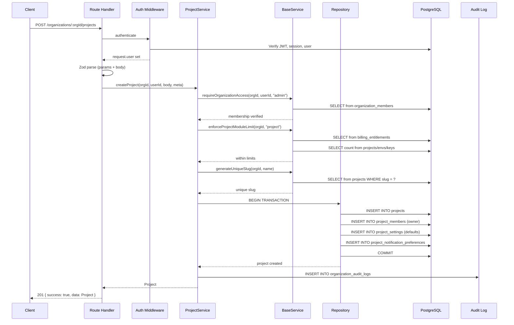
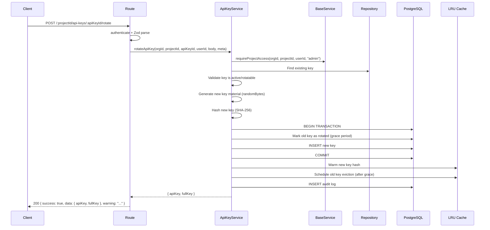
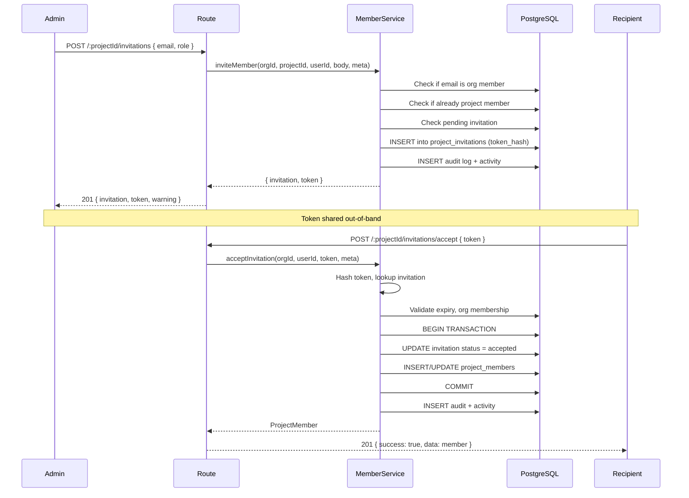

# PROJECT MODULE ROUTE AUDIT

> **Enterprise-Grade API Surface Documentation**
> Platform: Pulse — API Observability SaaS (Sentry/Datadog/New Relic class)
> Module: Projects
> Audit Date: 2026-07-20
> Auditor: Principal Backend Architect (Automated Static Analysis)
> Source of Truth: Codebase only — no reliance on existing documentation

---

## Table of Contents

- [1. Executive Summary](#1-executive-summary)
- [2. Route Inventory](#2-route-inventory)
- [3. Route Statistics](#3-route-statistics)
- [4. Endpoint Catalog](#4-endpoint-catalog)
  - [4.1 Project Management (CRUD)](#41-project-management-crud)
  - [4.2 Project Lifecycle](#42-project-lifecycle)
  - [4.3 Project Overview & Stats](#43-project-overview--stats)
  - [4.4 Project Settings](#44-project-settings)
  - [4.5 Project Activity](#45-project-activity)
  - [4.6 Environments](#46-environments)
  - [4.7 SDK Configurations](#47-sdk-configurations)
  - [4.8 API Keys](#48-api-keys)
  - [4.9 API Key Lifecycle](#49-api-key-lifecycle)
  - [4.10 API Key Bulk Operations](#410-api-key-bulk-operations)
  - [4.11 Project Members](#411-project-members)
  - [4.12 Project Invitations](#412-project-invitations)
  - [4.13 Custom Roles](#413-custom-roles)
  - [4.14 Connector Subscriptions (Alerting)](#414-connector-subscriptions-alerting)
  - [4.15 Alert Routes](#415-alert-routes)
  - [4.16 Alert Preferences](#416-alert-preferences)
  - [4.17 Usage Analytics](#417-usage-analytics)
- [5. RBAC Permission Matrix](#5-rbac-permission-matrix)
- [6. Validation Audit](#6-validation-audit)
- [7. Security Audit](#7-security-audit)
- [8. Performance Audit](#8-performance-audit)
- [9. Consistency Audit](#9-consistency-audit)
- [10. Missing Enterprise APIs](#10-missing-enterprise-apis)
- [11. Database Mapping](#11-database-mapping)
- [12. Dependency Graphs](#12-dependency-graphs)
- [13. Sequence Diagrams](#13-sequence-diagrams)
- [14. Architectural Recommendations](#14-architectural-recommendations)
- [15. Enterprise Readiness Assessment](#15-enterprise-readiness-assessment)
- [16. Prioritized Action Items](#16-prioritized-action-items)

---

## 1. Executive Summary

The Project Module is the central resource management layer of the Pulse observability platform. It governs the full lifecycle of projects, environments, API keys, members, invitations, custom roles, alert routing, connector subscriptions, and usage analytics within a multi-tenant, organization-scoped architecture.

### Key Findings

| Metric | Value |
|---|---|
| **Total Routes Discovered** | 55 |
| **Route Files** | 8 |
| **Sub-Modules** | 9 (core, settings, activity, environments, api-keys, members, alerts/routes, alerts/preferences, usage/analytics) |
| **Services** | 10 (ProjectsService facade + 9 bounded-context services) |
| **Repositories** | 10+ |
| **Authentication** | JWT Bearer — all routes |
| **Authorization** | Org membership + project membership (dual-layer RBAC) |
| **Validation** | Zod schemas on every route |
| **Audit Logging** | Present on all mutating operations |
| **Rate Limiting** | Partial — only on core and analytics routes |
| **Idempotency** | Partial — only on core write routes |
| **Critical Security Issues** | 6 |
| **High Performance Issues** | 8 |
| **Missing Enterprise APIs** | 22+ |

### Architecture Overview

```
projects.module.ts (Fastify plugin, boot-time registration)
├── routes.ts (orchestrator — registers all sub-route plugins)
│   ├── core/project.routes.ts        → 12 routes (CRUD, lifecycle, overview)
│   ├── settings/settings.routes.ts   → 2  routes (get/update settings)
│   ├── activity/activity.routes.ts   → 1  route  (activity feed)
│   ├── environments/environment.routes.ts → 11 routes (env CRUD, SDK configs)
│   ├── api-keys/api-key.routes.ts    → 12 routes (key CRUD, lifecycle, bulk)
│   ├── members/member.routes.ts      → 13 routes (members, invitations, roles)
│   ├── alerts/subscriptions/connector-subscription.routes.ts → 5 routes
│   └── usage/analytics.routes.ts     → 5  routes
├── alerts/routes/alert-routes.controller.ts → 6 routes (registered separately)
└── alerts/preferences/alert-preferences.controller.ts → 3 routes (registered separately)
```

**Base Prefix:** `/organizations/:orgId/projects`

---

## 2. Route Inventory

### Complete Route Table

| # | Method | URL | Route File | Handler/Service Method | Auth | Rate Limit | Idempotency |
|---|--------|-----|------------|----------------------|------|------------|-------------|
| 1 | `GET` | `/organizations/:orgId/projects` | `core/project.routes.ts` | `service.listProjects` | ✅ | ✅ 120/min | ❌ |
| 2 | `POST` | `/organizations/:orgId/projects` | `core/project.routes.ts` | `service.createProject` | ✅ | ✅ 30/min | ✅ |
| 3 | `GET` | `/organizations/:orgId/projects/:projectId` | `core/project.routes.ts` | `service.getProject` | ✅ | ✅ 120/min | ❌ |
| 4 | `GET` | `/organizations/:orgId/projects/:projectId/stats` | `core/project.routes.ts` | `service.getProjectStats` | ✅ | ✅ 120/min | ❌ |
| 5 | `GET` | `/organizations/:orgId/projects/:projectId/usage` | `core/project.routes.ts` | `service.getProjectUsage` | ✅ | ✅ 120/min | ❌ |
| 6 | `PATCH` | `/organizations/:orgId/projects/:projectId` | `core/project.routes.ts` | `service.updateProject` | ✅ | ✅ 30/min | ✅ |
| 7 | `DELETE` | `/organizations/:orgId/projects/:projectId` | `core/project.routes.ts` | `service.deleteProject` | ✅ | ✅ 30/min | ✅ |
| 8 | `POST` | `/organizations/:orgId/projects/:projectId/archive` | `core/project.routes.ts` | `service.archiveProject` | ✅ | ✅ 30/min | ✅ |
| 9 | `POST` | `/organizations/:orgId/projects/:projectId/unarchive` | `core/project.routes.ts` | `service.unarchiveProject` | ✅ | ✅ 30/min | ✅ |
| 10 | `POST` | `/organizations/:orgId/projects/:projectId/pause` | `core/project.routes.ts` | `service.pauseProject` | ✅ | ✅ 30/min | ✅ |
| 11 | `POST` | `/organizations/:orgId/projects/:projectId/resume` | `core/project.routes.ts` | `service.resumeProject` | ✅ | ✅ 30/min | ✅ |
| 12 | `POST` | `/organizations/:orgId/projects/:projectId/restore` | `core/project.routes.ts` | `service.restoreProject` | ✅ | ✅ 30/min | ✅ |
| 13 | `GET` | `/organizations/:orgId/projects/:projectId/overview` | `core/project.routes.ts` | `service.getProjectOverview` | ✅ | ✅ 120/min | ❌ |
| 14 | `GET` | `/organizations/:orgId/projects/:projectId/settings` | `settings/settings.routes.ts` | `service.getProjectSettings` | ✅ | ❌ | ❌ |
| 15 | `PATCH` | `/organizations/:orgId/projects/:projectId/settings` | `settings/settings.routes.ts` | `service.updateProjectSettings` | ✅ | ❌ | ❌ |
| 16 | `GET` | `/organizations/:orgId/projects/:projectId/activity` | `activity/activity.routes.ts` | `service.listProjectActivity` | ✅ | ❌ | ❌ |
| 17 | `GET` | `/organizations/:orgId/projects/:projectId/environments` | `environments/environment.routes.ts` | `service.listEnvironments` | ✅ | ❌ | ❌ |
| 18 | `POST` | `/organizations/:orgId/projects/:projectId/environments` | `environments/environment.routes.ts` | `service.createEnvironment` | ✅ | ❌ | ❌ |
| 19 | `GET` | `/organizations/:orgId/projects/:projectId/environments/:environmentId` | `environments/environment.routes.ts` | `service.getEnvironment` | ✅ | ❌ | ❌ |
| 20 | `PATCH` | `/organizations/:orgId/projects/:projectId/environments/:environmentId` | `environments/environment.routes.ts` | `service.updateEnvironment` | ✅ | ❌ | ❌ |
| 21 | `DELETE` | `/organizations/:orgId/projects/:projectId/environments/:environmentId` | `environments/environment.routes.ts` | `service.deleteEnvironment` | ✅ | ❌ | ❌ |
| 22 | `GET` | `/organizations/:orgId/projects/:projectId/sdk-configs` | `environments/environment.routes.ts` | `sdkConfigService.listConfigs` | ✅ | ❌ | ❌ |
| 23 | `GET` | `/organizations/:orgId/projects/:projectId/sdk-configs/resolve` | `environments/environment.routes.ts` | `sdkConfigService.resolveForSdk` | ✅ | ❌ | ❌ |
| 24 | `GET` | `/organizations/:orgId/projects/:projectId/sdk-configs/:configId` | `environments/environment.routes.ts` | `sdkConfigService.getConfig` | ✅ | ❌ | ❌ |
| 25 | `PATCH` | `/organizations/:orgId/projects/:projectId/sdk-configs/:configId` | `environments/environment.routes.ts` | `sdkConfigService.updateProjectConfig` | ✅ | ❌ | ❌ |
| 26 | `GET` | `/organizations/:orgId/projects/:projectId/api-keys` | `api-keys/api-key.routes.ts` | `service.listApiKeys` | ✅ | ❌ | ❌ |
| 27 | `POST` | `/organizations/:orgId/projects/:projectId/api-keys` | `api-keys/api-key.routes.ts` | `service.createApiKey` | ✅ | ❌ | ❌ |
| 28 | `POST` | `/organizations/:orgId/projects/:projectId/api-keys/bulk-rotate` | `api-keys/api-key.routes.ts` | `service.bulkRotateKeys` | ✅ | ❌ | ❌ |
| 29 | `POST` | `/organizations/:orgId/projects/:projectId/api-keys/bulk-revoke` | `api-keys/api-key.routes.ts` | `service.bulkRevokeKeys` | ✅ | ❌ | ❌ |
| 30 | `GET` | `/organizations/:orgId/projects/:projectId/api-keys/:apiKeyId` | `api-keys/api-key.routes.ts` | `service.getApiKey` | ✅ | ❌ | ❌ |
| 31 | `PATCH` | `/organizations/:orgId/projects/:projectId/api-keys/:apiKeyId` | `api-keys/api-key.routes.ts` | `service.updateApiKey` | ✅ | ❌ | ❌ |
| 32 | `DELETE` | `/organizations/:orgId/projects/:projectId/api-keys/:apiKeyId` | `api-keys/api-key.routes.ts` | `service.deleteApiKey` | ✅ | ❌ | ❌ |
| 33 | `POST` | `/organizations/:orgId/projects/:projectId/api-keys/:apiKeyId/rotate` | `api-keys/api-key.routes.ts` | `service.rotateApiKey` | ✅ | ❌ | ❌ |
| 34 | `POST` | `/organizations/:orgId/projects/:projectId/api-keys/:apiKeyId/regenerate` | `api-keys/api-key.routes.ts` | `service.regenerateApiKey` | ✅ | ❌ | ❌ |
| 35 | `POST` | `/organizations/:orgId/projects/:projectId/api-keys/:apiKeyId/enable` | `api-keys/api-key.routes.ts` | `service.enableApiKey` | ✅ | ❌ | ❌ |
| 36 | `POST` | `/organizations/:orgId/projects/:projectId/api-keys/:apiKeyId/disable` | `api-keys/api-key.routes.ts` | `service.disableApiKey` | ✅ | ❌ | ❌ |
| 37 | `GET` | `/organizations/:orgId/projects/:projectId/api-keys/:apiKeyId/usage` | `api-keys/api-key.routes.ts` | `service.getApiKeyUsage` | ✅ | ❌ | ❌ |
| 38 | `GET` | `/organizations/:orgId/projects/:projectId/members` | `members/member.routes.ts` | `service.members.listMembers` | ✅ | ❌ | ❌ |
| 39 | `POST` | `/organizations/:orgId/projects/:projectId/members` | `members/member.routes.ts` | `service.members.addMember` | ✅ | ❌ | ❌ |
| 40 | `PATCH` | `/organizations/:orgId/projects/:projectId/members/:memberId` | `members/member.routes.ts` | `service.members.updateMemberRole` | ✅ | ❌ | ❌ |
| 41 | `DELETE` | `/organizations/:orgId/projects/:projectId/members/:memberId` | `members/member.routes.ts` | `service.members.removeMember` | ✅ | ❌ | ❌ |
| 42 | `POST` | `/organizations/:orgId/projects/:projectId/transfer-ownership` | `members/member.routes.ts` | `service.members.transferOwnership` | ✅ | ❌ | ❌ |
| 43 | `GET` | `/organizations/:orgId/projects/:projectId/invitations` | `members/member.routes.ts` | `service.members.listInvitations` | ✅ | ❌ | ❌ |
| 44 | `POST` | `/organizations/:orgId/projects/:projectId/invitations` | `members/member.routes.ts` | `service.members.inviteMember` | ✅ | ❌ | ❌ |
| 45 | `POST` | `/organizations/:orgId/projects/:projectId/invitations/accept` | `members/member.routes.ts` | `service.members.acceptInvitation` | ✅ | ❌ | ❌ |
| 46 | `POST` | `/organizations/:orgId/projects/:projectId/invitations/:invitationId/decline` | `members/member.routes.ts` | `service.members.declineInvitation` | ✅ | ❌ | ❌ |
| 47 | `DELETE` | `/organizations/:orgId/projects/:projectId/invitations/:invitationId` | `members/member.routes.ts` | `service.members.cancelInvitation` | ✅ | ❌ | ❌ |
| 48 | `GET` | `/organizations/:orgId/projects/:projectId/roles` | `members/member.routes.ts` | `service.members.listRoles` | ✅ | ❌ | ❌ |
| 49 | `POST` | `/organizations/:orgId/projects/:projectId/roles` | `members/member.routes.ts` | `service.members.createRole` | ✅ | ❌ | ❌ |
| 50 | `PATCH` | `/organizations/:orgId/projects/:projectId/roles/:roleId` | `members/member.routes.ts` | `service.members.updateRole` | ✅ | ❌ | ❌ |
| 51 | `DELETE` | `/organizations/:orgId/projects/:projectId/roles/:roleId` | `members/member.routes.ts` | `service.members.deleteRole` | ✅ | ❌ | ❌ |
| 52 | `GET` | `/organizations/:orgId/projects/:projectId/connectors` | `alerts/subscriptions/connector-subscription.routes.ts` | `connectorSubscriptionsService.list` | ✅ | ❌ | ❌ |
| 53 | `POST` | `/organizations/:orgId/projects/:projectId/connectors` | `alerts/subscriptions/connector-subscription.routes.ts` | `connectorSubscriptionsService.create` | ✅ | ❌ | ❌ |
| 54 | `GET` | `/organizations/:orgId/projects/:projectId/connectors/:subscriptionId` | `alerts/subscriptions/connector-subscription.routes.ts` | `connectorSubscriptionsService.get` | ✅ | ❌ | ❌ |
| 55 | `PATCH` | `/organizations/:orgId/projects/:projectId/connectors/:subscriptionId` | `alerts/subscriptions/connector-subscription.routes.ts` | `connectorSubscriptionsService.update` | ✅ | ❌ | ❌ |
| 56 | `DELETE` | `/organizations/:orgId/projects/:projectId/connectors/:subscriptionId` | `alerts/subscriptions/connector-subscription.routes.ts` | `connectorSubscriptionsService.delete` | ✅ | ❌ | ❌ |
| 57 | `POST` | `/organizations/:orgId/projects/:projectId/alert-routes` | `alerts/routes/alert-routes.controller.ts` | `alertRoutesService.createRoute` | ✅ | ❌ | ❌ |
| 58 | `GET` | `/organizations/:orgId/projects/:projectId/alert-routes` | `alerts/routes/alert-routes.controller.ts` | `alertRoutesService.listRoutes` | ✅ | ❌ | ❌ |
| 59 | `GET` | `/organizations/:orgId/projects/:projectId/alert-routes/:routeId` | `alerts/routes/alert-routes.controller.ts` | `alertRoutesService.getRoute` | ✅ | ❌ | ❌ |
| 60 | `PATCH` | `/organizations/:orgId/projects/:projectId/alert-routes/:routeId` | `alerts/routes/alert-routes.controller.ts` | `alertRoutesService.updateRoute` | ✅ | ❌ | ❌ |
| 61 | `DELETE` | `/organizations/:orgId/projects/:projectId/alert-routes/:routeId` | `alerts/routes/alert-routes.controller.ts` | `alertRoutesService.deleteRoute` | ✅ | ❌ | ❌ |
| 62 | `POST` | `/organizations/:orgId/projects/:projectId/alert-routes/:routeId/toggle` | `alerts/routes/alert-routes.controller.ts` | `alertRoutesService.toggleRoute` | ✅ | ❌ | ❌ |
| 63 | `GET` | `/organizations/:orgId/projects/:projectId/members/me/alert-preferences` | `alerts/preferences/alert-preferences.controller.ts` | `alertPreferencesService.getPreferences` | ✅ | ❌ | ❌ |
| 64 | `PATCH` | `/organizations/:orgId/projects/:projectId/members/me/alert-preferences/:prefId` | `alerts/preferences/alert-preferences.controller.ts` | `alertPreferencesService.updatePreference` | ✅ | ❌ | ❌ |
| 65 | `POST` | `/organizations/:orgId/projects/:projectId/members/me/alert-preferences/sync` | `alerts/preferences/alert-preferences.controller.ts` | `alertPreferencesService.sync` | ✅ | ❌ | ❌ |
| 66 | `GET` | `/organizations/:orgId/projects/:projectId/analytics/usage` | `usage/analytics.routes.ts` | `analytics.getUsageAnalytics` | ✅ | ✅ 120/min | ❌ |
| 67 | `GET` | `/organizations/:orgId/projects/:projectId/analytics/heatmap` | `usage/analytics.routes.ts` | `analytics.getHeatmap` | ✅ | ✅ 120/min | ❌ |
| 68 | `GET` | `/organizations/:orgId/projects/:projectId/analytics/top` | `usage/analytics.routes.ts` | `analytics.getTopList` | ✅ | ✅ 120/min | ❌ |
| 69 | `GET` | `/organizations/:orgId/projects/:projectId/analytics/comparison` | `usage/analytics.routes.ts` | `analytics.getComparison` | ✅ | ✅ 120/min | ❌ |
| 70 | `GET` | `/organizations/:orgId/projects/:projectId/analytics/monthly-usage` | `usage/analytics.routes.ts` | `analytics.getMonthlyUsageVsPlan` | ✅ | ✅ 120/min | ❌ |

**Total: 70 routes** (including dynamically registered lifecycle routes)

---

## 3. Route Statistics

| Category | Count |
|---|---|
| `GET` routes | 30 |
| `POST` routes | 24 |
| `PATCH` routes | 10 |
| `DELETE` routes | 6 |
| **Total** | **70** |
| With rate limiting | 17 |
| Without rate limiting | 53 |
| With idempotency | 8 |
| Without idempotency | 62 |
| With Zod validation | 70 |
| With audit logging | ~35 (all mutating) |

| Sub-Module | Routes |
|---|---|
| Project Core (CRUD + lifecycle) | 13 |
| Project Settings | 2 |
| Project Activity | 1 |
| Environments + SDK Configs | 9 |
| API Keys | 12 |
| Members | 5 |
| Invitations | 5 |
| Custom Roles | 4 |
| Connector Subscriptions | 5 |
| Alert Routes | 6 |
| Alert Preferences | 3 |
| Usage Analytics | 5 |

---

## 4. Endpoint Catalog

### 4.1 Project Management (CRUD)

---

#### `GET /organizations/:orgId/projects`

**Purpose:** List all projects within an organization with pagination, filtering, sorting, and search.

| Field | Value |
|---|---|
| **Controller** | `projectCoreRoutes` |
| **Handler** | `service.listProjects` → `core.listProjects` |
| **File** | `core/project.routes.ts:62–75` |
| **Authentication** | Required (JWT Bearer) |
| **Authorization** | Org membership (viewer+) via `requireOrganizationAccess` |
| **Rate Limit** | ✅ 120 req/min |

**Request Parameters:**

| Location | Name | Type | Required | Validation | Default |
|---|---|---|---|---|---|
| Path | `orgId` | string | ✅ | UUID | — |
| Query | `status` | string | ❌ | `active \| paused \| archived` | — |
| Query | `search` | string | ❌ | min:1, max:100 | — |
| Query | `includeDeleted` | boolean | ❌ | coerced | — |
| Query | `page` | number | ❌ | int, min:1 | — |
| Query | `limit` | number | ❌ | int, min:1, max:100 | `20` |
| Query | `offset` | number | ❌ | int, min:0 | — |
| Query | `sortBy` | string | ❌ | `created_at \| updated_at \| name` | `created_at` |
| Query | `sortOrder` | string | ❌ | `asc \| desc` | `desc` |

**Success Response (200):**
```json
{
  "success": true,
  "data": [ProjectListItem],
  "meta": { "total": number, "limit": number, "offset": number }
}
```

**Error Responses:** `401` Unauthorized, `403` Insufficient Permissions, `422` Validation Error, `500` Internal Error

**Database:** `projects` (read), `organization_members` (read for auth)

---

#### `POST /organizations/:orgId/projects`

**Purpose:** Create a new project within an organization. Provisions default settings, environments, SDK configs, notification preferences, and adds the creator as project owner.

| Field | Value |
|---|---|
| **Controller** | `projectCoreRoutes` |
| **Handler** | `service.createProject` → `core.createProject` |
| **File** | `core/project.routes.ts:77–86` |
| **Authentication** | Required |
| **Authorization** | Org admin+ via `requireOrganizationAccess(orgId, userId, "admin")` |
| **Rate Limit** | ✅ 30 req/min |
| **Idempotency** | ✅ |

**Request Body:**

| Field | Type | Required | Validation | Default |
|---|---|---|---|---|
| `name` | string | ✅ | min:1, max:255 | — |
| `description` | string \| null | ❌ | max:5000 | `null` |
| `visibility` | string | ❌ | `private \| organization \| public` | `private` |
| `status` | string | ❌ | `active \| paused \| archived` | `active` |
| `timezone` | string | ❌ | max:100 | `UTC` |
| `tags` | string[] | ❌ | items: min:1/max:50, max 20 items | — |
| `icon` | string \| null | ❌ | max:255 | `null` |
| `color` | string \| null | ❌ | max:20 | `null` |
| `metadata` | Record | ❌ | — | `{}` |

**Success Response (201):**
```json
{ "success": true, "data": Project }
```

**Side Effects:**
- Project row inserted in `projects`
- Creator added to `project_members` as `owner`
- Default settings created in `project_settings`
- Notification preferences seeded in `project_notification_preferences`
- Audit log entry in `organization_audit_logs` (action: `project.created`)
- Billing entitlements checked (project limit enforcement)

**Database Operations:**
- **Read:** `organization_members`, `billing_entitlements`, `projects` (slug check)
- **Write (Transaction):** `projects`, `project_members`, `project_settings`, `project_notification_preferences`
- **Write:** `organization_audit_logs`

---

#### `GET /organizations/:orgId/projects/:projectId`

**Purpose:** Retrieve a single project by ID.

| Field | Value |
|---|---|
| **Handler** | `service.getProject` → `core.getProject` → `requireProjectAccess(viewer)` |
| **Authorization** | Project member (viewer+) |
| **Rate Limit** | ✅ 120/min |

**Path Parameters:** `orgId` (UUID), `projectId` (UUID)

**Success Response (200):** `{ "success": true, "data": Project }`

**Error Responses:** `401`, `403`, `404` Project Not Found, `500`

---

#### `PATCH /organizations/:orgId/projects/:projectId`

**Purpose:** Partial update of project fields. Validates status transitions, enforces billing on reactivation, and evicts cached API keys when a project is deactivated.

| Field | Value |
|---|---|
| **Handler** | `service.updateProject` → `core.updateProject` |
| **Authorization** | Org admin+ or project admin+ via `requireProjectAccess(orgId, projectId, userId, "admin")` |
| **Rate Limit** | ✅ 30/min |
| **Idempotency** | ✅ |

**Request Body:** Same fields as create (all optional) + `version` (int, optimistic concurrency)

**Concurrency Control:** Optional `version` field enables optimistic locking. The repository checks `WHERE version = $expected` and raises `PROJECT_CONCURRENT_UPDATE` (409) on mismatch.

**Side Effects:**
- Audit log (action: `project.updated`)
- Cache eviction of project API keys when status transitions to non-active

---

#### `DELETE /organizations/:orgId/projects/:projectId`

**Purpose:** Soft-delete a project. Revokes all active API keys, evicts key caches, and stamps `deleted_at`/`deleted_by`.

| Field | Value |
|---|---|
| **Handler** | `service.deleteProject` → `core.deleteProject` |
| **Authorization** | Project owner only via `requireProjectAccess(orgId, projectId, userId, "owner")` |
| **Rate Limit** | ✅ 30/min |
| **Idempotency** | ✅ |

**Success Response:** `204 No Content`

**Side Effects:**
- All active API keys revoked (reason: `project_deleted`) within a transaction
- LRU cache eviction for all project key hashes
- Audit log (action: `project.deleted`, sensitive: true)
- Row is retained; `deleted_at` is set, not row removal

---

### 4.2 Project Lifecycle

All lifecycle routes follow the same pattern: `POST /:projectId/{action}` with `authenticate + writeRateLimit + idempotencyKey` middleware. They are dynamically registered via a loop in `core/project.routes.ts:138–154`.

| Route | Service Method | Required Role | Validates |
|---|---|---|---|
| `POST /:projectId/archive` | `archiveProject` | admin+ | Status != archived already |
| `POST /:projectId/unarchive` | `unarchiveProject` | admin+ | Status == archived |
| `POST /:projectId/pause` | `pauseProject` | admin+ | Status != paused already |
| `POST /:projectId/resume` | `resumeProject` | admin+ | Status == paused |
| `POST /:projectId/restore` | `restoreProject` | org owner | Has `deleted_at` set |

**Valid Status Transitions:**
```
active → paused, archived
paused → active, archived
archived → active
```

`restore` operates on soft-deleted projects (`deleted_at IS NOT NULL`), distinct from `unarchive`.

---

### 4.3 Project Overview & Stats

#### `GET /:projectId/overview`
Returns composite data: project, settings, member count, API key count, and usage metrics (hourly breakdown, daily trend, heatmap). Authorization: viewer+.

#### `GET /:projectId/stats`
Returns aggregate statistics: total requests, API key counts (total + active), environment count. Authorization: org member+ via `requireProjectAccess(member)`.

#### `GET /:projectId/usage`
Returns raw usage counters from `project_usage_counters`. Authorization: org member+.

---

### 4.4 Project Settings

#### `GET /:projectId/settings`
Retrieves project settings (retention, rate limits, alerting, ingestion toggles). Authorization: viewer+ (via project access).

#### `PATCH /:projectId/settings`
Updates settings. Authorization: admin+.

**Request Body:**

| Field | Type | Required | Default |
|---|---|---|---|
| `retentionDays` | number | ❌ | — |
| `maxEventsPerSecond` | number | ❌ | — |
| `autoArchive` | boolean | ❌ | — |
| `alertingEnabled` | boolean | ❌ | — |
| `ingestionEnabled` | boolean | ❌ | — |

> ⚠️ **Finding:** `UpdateProjectSettingsBodySchema` does NOT use `normalizeObjectKeys` or `z.preprocess`, unlike all other schemas in the module. Snake_case keys will not be auto-aliased.

---

### 4.5 Project Activity

#### `GET /:projectId/activity`
Returns a cursor-paginated feed of project activity events (member changes, key operations, setting changes).

**Query Parameters:**

| Name | Type | Required | Default |
|---|---|---|---|
| `cursor` | string | ❌ | — |
| `limit` | number | ❌ | `25` (max 100) |
| `action` | string | ❌ | — |

---

### 4.6 Environments

Full CRUD for project environments with rate limiting, IP allowlisting/blocklisting, HTTPS enforcement, and alert configuration.

| Route | Method | Description |
|---|---|---|
| `GET /:projectId/environments` | List | All environments for a project |
| `POST /:projectId/environments` | Create | New environment with rate limits, IP rules |
| `GET /:projectId/environments/:environmentId` | Read | Single environment |
| `PATCH /:projectId/environments/:environmentId` | Update | Partial update |
| `DELETE /:projectId/environments/:environmentId` | Delete | Remove environment |

**Environment Fields:**

| Field | Type | Validation |
|---|---|---|
| `name` | string | min:1, max:100, regex: `^[a-zA-Z0-9_-]+$` |
| `description` | string \| null | max:2000 |
| `color` | string \| null | max:20 |
| `icon` | string \| null | max:255 |
| `isActive` | boolean | coerced |
| `isDefault` | boolean | coerced |
| `rateLimitPerSecond` | number \| null | int, 1–1M |
| `rateLimitPerMinute` | number \| null | int, 1–100M |
| `rateLimitPerHour` | number \| null | int, 1–1B |
| `burstLimit` | number \| null | int, 1–1M |
| `allowedEventTypes` | string[] | max 100 items |
| `maxEventSizeBytes` | number \| null | int, 1–64MB |
| `maxBatchSize` | number \| null | int, 1–10K |
| `requireHttps` | boolean | coerced |
| `ipAllowlist` | string[] \| null | IPv4/v6 CIDR, max 256 |
| `ipBlocklist` | string[] \| null | IPv4/v6 CIDR, max 256 |
| `alertEmail` | string \| null | email, max:255 |
| `alertWebhookUrl` | string \| null | URL, max:500 |

---

### 4.7 SDK Configurations

| Route | Description |
|---|---|
| `GET /:projectId/sdk-configs` | List SDK configs (filtered by project) |
| `GET /:projectId/sdk-configs/resolve` | Resolve SDK config for a specific env/platform |
| `GET /:projectId/sdk-configs/:configId` | Get single SDK config |
| `PATCH /:projectId/sdk-configs/:configId` | Update SDK config |

These routes delegate to `fastify.organization.sdkConfigService`, bridging project-scoped access to org-level SDK configuration management. Each route first validates project membership via `service.getProject()`, then delegates to the organization SDK config service.

---

### 4.8 API Keys

Full lifecycle management with security-first design. Keys are minted in memory; only hash + prefix persist. The full key is returned exactly once on creation/rotation.

| Route | Description |
|---|---|
| `GET /:projectId/api-keys` | List API keys with filtering |
| `POST /:projectId/api-keys` | Create API key |
| `GET /:projectId/api-keys/:apiKeyId` | Get single API key |
| `PATCH /:projectId/api-keys/:apiKeyId` | Update API key |
| `DELETE /:projectId/api-keys/:apiKeyId` | Revoke API key (soft) |

**Key Types:** `read_write`, `read_only`, `write_only`, `temporary`

**Key Statuses:** `active`, `revoked`, `expired`, `rotated`, `suspended`

**Create API Key Request:**

| Field | Type | Required | Default |
|---|---|---|---|
| `environmentId` | UUID | ✅ | — |
| `name` | string \| null | ❌ | — |
| `description` | string \| null | ❌ | max:2000 |
| `keyType` | enum | ❌ | `read_write` |
| `expiresAt` | Date \| null | ❌ | — |
| `autoRotateEnabled` | boolean | ❌ | — |
| `autoRotateDays` | number | ❌ | 1–365 |
| `permissions` | string[] | ❌ | type-based defaults |
| `allowedEndpoints` | string[] | ❌ | max 100 |
| `blockedEndpoints` | string[] | ❌ | max 100 |
| `allowedEventTypes` | string[] | ❌ | max 100 |
| `allowedOrigins` | string[] | ❌ | max 100 |
| `allowedIps` | string[] | ❌ | IPv4/v6, max 256 |
| `allowedDomains` | string[] | ❌ | max 100 |
| `samplingRules` | Record | ❌ | — |
| `featureFlags` | Record | ❌ | — |
| `sdkConfig` | Record | ❌ | — |
| `rateLimitPerSecond` | number \| null | ❌ | 1–1M |
| `rateLimitPerMinute` | number \| null | ❌ | 1–100M |
| `rateLimitPerHour` | number \| null | ❌ | 1–1B |

---

### 4.9 API Key Lifecycle

| Route | Description |
|---|---|
| `POST /:projectId/api-keys/:apiKeyId/rotate` | Rotate key with optional grace period |
| `POST /:projectId/api-keys/:apiKeyId/regenerate` | Emergency regenerate (instant revoke of old key) |
| `POST /:projectId/api-keys/:apiKeyId/enable` | Re-enable a disabled key |
| `POST /:projectId/api-keys/:apiKeyId/disable` | Disable a key |
| `GET /:projectId/api-keys/:apiKeyId/usage` | Get key usage statistics |

**Rotate Body:**

| Field | Type | Required | Default |
|---|---|---|---|
| `name` | string \| null | ❌ | — |
| `expiresAt` | Date \| null | ❌ | — |
| `rotationReason` | string | ❌ | max:500 |
| `gracePeriodHours` | number | ❌ | 0–168 |

---

### 4.10 API Key Bulk Operations

| Route | Description |
|---|---|
| `POST /:projectId/api-keys/bulk-rotate` | Rotate all active keys for a project/environment |
| `POST /:projectId/api-keys/bulk-revoke` | Revoke multiple keys at once |

**Bulk Rotate Body:**

| Field | Type | Required |
|---|---|---|
| `environmentId` | UUID | ❌ (filter) |
| `rotationReason` | string | ❌ |
| `gracePeriodHours` | number | ❌ |

**Bulk Revoke Body:**

| Field | Type | Required |
|---|---|---|
| `environmentId` | UUID | ❌ (filter) |
| `apiKeyIds` | UUID[] | ❌ (1–100) |
| `revokedReason` | string | ❌ |

---

### 4.11 Project Members

| Route | Method | Authorization |
|---|---|---|
| `GET /:projectId/members` | List | viewer+ |
| `POST /:projectId/members` | Add | admin+ |
| `PATCH /:projectId/members/:memberId` | Update role | admin+ |
| `DELETE /:projectId/members/:memberId` | Remove | admin+ |
| `POST /:projectId/transfer-ownership` | Transfer | owner only |

**Business Rules:**
- Cannot add yourself
- User must be an active org member before joining a project
- Owner cannot be removed (must transfer first)
- Owner role cannot be changed (must transfer)
- Re-adding a previously removed member restores them with the new role

---

### 4.12 Project Invitations

| Route | Description | Auth |
|---|---|---|
| `GET /:projectId/invitations` | List invitations | viewer+ |
| `POST /:projectId/invitations` | Create invitation | admin+ |
| `POST /:projectId/invitations/accept` | Accept invitation | authenticated |
| `POST /:projectId/invitations/:invitationId/decline` | Decline | authenticated |
| `DELETE /:projectId/invitations/:invitationId` | Cancel | admin+ |

**Invitation Flow:**
1. Admin creates invitation → token generated and returned once
2. Recipient calls accept with token → validated, member row created
3. Invitation hash stored for verification; token never persisted in plaintext
4. Expiry: 7 days (hardcoded constant `INVITATION_EXPIRY_DAYS`)
5. Re-invitation to same email refreshes the token and expiry

---

### 4.13 Custom Roles

| Route | Description | Auth |
|---|---|---|
| `GET /:projectId/roles` | List roles | viewer+ |
| `POST /:projectId/roles` | Create role | admin+ |
| `PATCH /:projectId/roles/:roleId` | Update role | admin+ |
| `DELETE /:projectId/roles/:roleId` | Delete role | admin+ |

**Create Role Body:**

| Field | Type | Required |
|---|---|---|
| `name` | string | ✅ (1–100) |
| `slug` | string | ✅ (1–100, regex: `^[a-z0-9_-]+$`) |
| `description` | string \| null | ❌ |
| `permissions` | string[] | ❌ (max 100) |
| `isDefault` | boolean | ❌ |

---

### 4.14 Connector Subscriptions (Alerting)

Manages which alert connectors (Slack, email, webhook, etc.) are subscribed to a project for alert delivery.

| Route | Description |
|---|---|
| `GET /:projectId/connectors` | List connector subscriptions |
| `POST /:projectId/connectors` | Subscribe a connector |
| `GET /:projectId/connectors/:subscriptionId` | Get subscription |
| `PATCH /:projectId/connectors/:subscriptionId` | Update subscription |
| `DELETE /:projectId/connectors/:subscriptionId` | Remove subscription |

**Create Subscription Body:**

| Field | Type | Required | Default |
|---|---|---|---|
| `connectorId` | UUID | ✅ | — |
| `enabled` | boolean | ❌ | `true` |
| `alertCategories` | enum[] | ❌ | `["error","performance","security"]` |
| `severityThreshold` | enum | ❌ | `"error"` |
| `memberIds` | UUID[] | ❌ | `[]` |
| `channelOverrides` | Record | ❌ | `{}` |
| `quietHours` | Record \| null | ❌ | — |
| `digestMode` | Record \| null | ❌ | — |

---

### 4.15 Alert Routes

Registered under prefix: `/organizations/:orgId/projects/:projectId/alert-routes`

| Route | Description |
|---|---|
| `POST /` | Create alert route |
| `GET /` | List alert routes |
| `GET /:routeId` | Get alert route |
| `PATCH /:routeId` | Update alert route |
| `DELETE /:routeId` | Delete alert route |
| `POST /:routeId/toggle` | Toggle active/inactive |

> ⚠️ **Finding:** Alert route controller does NOT use `withErrorHandling` wrapper. Errors are not caught by the standard project error handler — they bubble to the global Fastify error handler instead.

---

### 4.16 Alert Preferences

Registered under prefix: `/organizations/:orgId/projects/:projectId/members/me/alert-preferences`

| Route | Description |
|---|---|
| `GET /` | Get current user's alert preferences |
| `PATCH /:prefId` | Update a preference |
| `POST /sync` | Sync preferences (create missing defaults) |

> ⚠️ **Finding:** Same error handling gap as alert routes — no `withErrorHandling` wrapper.

---

### 4.17 Usage Analytics

Advanced analytics with time-series, heatmaps, top-N lists, environment comparisons, and monthly usage vs. plan.

| Route | Description |
|---|---|
| `GET /:projectId/analytics/usage` | Time-series usage analytics |
| `GET /:projectId/analytics/heatmap` | Calendar/hourly/day-of-week heatmap |
| `GET /:projectId/analytics/top` | Top endpoints/services/errors/etc. |
| `GET /:projectId/analytics/comparison` | Compare environments or API keys |
| `GET /:projectId/analytics/monthly-usage` | Monthly usage vs. plan limits |

All analytics routes share a 120 req/min rate limit.

**Usage Analytics Query:**

| Field | Type | Required | Default |
|---|---|---|---|
| `from` | Date | ✅ | — |
| `to` | Date | ✅ | — |
| `granularity` | enum | ❌ | `hourly` |
| `environmentId` | UUID | ❌ | — |
| `apiKeyId` | UUID | ❌ | — |
| `release` | string | ❌ | — |
| `sdkVersion` | string | ❌ | — |
| `service` | string | ❌ | — |
| `endpoint` | string | ❌ | — |
| `region` | string | ❌ | — |
| `eventType` | string | ❌ | — |
| `severity` | string | ❌ | — |
| `tag` | string | ❌ | — |
| `limit` | number | ❌ | `100` (max 1000) |
| `offset` | number | ❌ | `0` |
| `cursor` | string | ❌ | — |

---

## 5. RBAC Permission Matrix

### Organization Roles (used for project access)

| Role | Hierarchy | Description |
|---|---|---|
| `owner` | 100 | Full control |
| `admin` | 80 | Administrative access |
| `developer` | 60 | Development access |
| `security` | 50 | Security-specific |
| `billing` | 50 | Billing-specific |
| `member` | 40 | Standard member |
| `viewer` | 20 | Read-only |

### Project Roles

| Role | Hierarchy | Description |
|---|---|---|
| `owner` | 4 | Project owner |
| `admin` | 3 | Project admin |
| `developer` | 2 | Developer |
| `qa` | 2 | QA (same level as developer) |
| `viewer` | 1 | Read-only |

### Permission Matrix per Route

| # | Route | Owner | Admin | Developer | QA | Viewer | Auth Type |
|---|---|---|---|---|---|---|---|
| 1 | `GET /projects` | ✅ | ✅ | ✅ | ✅ | ✅ | Org viewer+ |
| 2 | `POST /projects` | ✅ | ✅ | ❌ | ❌ | ❌ | Org admin+ |
| 3 | `GET /projects/:id` | ✅ | ✅ | ✅ | ✅ | ✅ | Project viewer+ |
| 4 | `PATCH /projects/:id` | ✅ | ✅ | ❌ | ❌ | ❌ | Project admin+ |
| 5 | `DELETE /projects/:id` | ✅ | ❌ | ❌ | ❌ | ❌ | Project owner |
| 6 | `POST /:id/archive` | ✅ | ✅ | ❌ | ❌ | ❌ | Project admin+ |
| 7 | `POST /:id/unarchive` | ✅ | ✅ | ❌ | ❌ | ❌ | Project admin+ |
| 8 | `POST /:id/pause` | ✅ | ✅ | ❌ | ❌ | ❌ | Project admin+ |
| 9 | `POST /:id/resume` | ✅ | ✅ | ❌ | ❌ | ❌ | Project admin+ |
| 10 | `POST /:id/restore` | ✅ | ❌ | ❌ | ❌ | ❌ | Org owner |
| 11 | `GET /:id/overview` | ✅ | ✅ | ✅ | ✅ | ✅ | Project viewer+ |
| 12 | `GET /:id/stats` | ✅ | ✅ | ✅ | ✅ | ✅ | Org member+ |
| 13 | `GET /:id/usage` | ✅ | ✅ | ✅ | ✅ | ✅ | Org member+ |
| 14 | `GET /:id/settings` | ✅ | ✅ | ✅ | ✅ | ✅ | Project viewer+ |
| 15 | `PATCH /:id/settings` | ✅ | ✅ | ❌ | ❌ | ❌ | Project admin+¹ |
| 16 | `GET /:id/activity` | ✅ | ✅ | ✅ | ✅ | ✅ | Project viewer+ |
| 17–21 | `Environments CRUD` | ✅ | ✅ | ⚠️² | ⚠️² | ⚠️² | Varies |
| 22–25 | `SDK Configs` | ✅ | ✅ | ⚠️² | ⚠️² | ⚠️² | Varies |
| 26–37 | `API Keys` | ✅ | ✅ | ⚠️³ | ⚠️³ | ⚠️³ | Varies |
| 38–41 | `Members` | ✅ | ✅ | ❌/R | ❌/R | R | Admin+ for writes |
| 42 | `Transfer ownership` | ✅ | ❌ | ❌ | ❌ | ❌ | Owner only |
| 43–47 | `Invitations` | ✅ | ✅ | R | R | R | Admin+ for writes |
| 48–51 | `Roles` | ✅ | ✅ | R | R | R | Admin+ for writes |
| 52–56 | `Connectors` | ✅ | ✅ | ⚠️ | ⚠️ | ⚠️ | Not verified |
| 57–62 | `Alert Routes` | ✅ | ✅ | ⚠️ | ⚠️ | ⚠️ | Not verified |
| 63–65 | `Alert Prefs` | ✅ | ✅ | ✅ | ✅ | ✅ | Self only |
| 66–70 | `Analytics` | ✅ | ✅ | ✅ | ✅ | ✅ | Org member+ |

**Legend:** R = Read-only access, ⚠️ = Authorization delegated to service layer (not verified in route)

**Notes:**
1. ¹Settings update uses `authenticate` only in route; the service enforces admin+ internally.
2. ²Environment/SDK config routes delegate auth to `service.getProject()` which requires project viewer+; write authorization is enforced inside the service layer.
3. ³API key operations authorization is fully delegated to the service layer — the route itself only calls `authenticate`.

> ⚠️ **Finding: Inconsistent Authorization Patterns**
> Some routes enforce authorization in the preHandler (middleware), others delegate entirely to the service layer. This creates a risk if a service is reused from a different entry point that doesn't call the same authorization checks.

---

## 6. Validation Audit

### Validation Coverage

| Category | Status | Details |
|---|---|---|
| Input validation (Zod) | ✅ Complete | Every route parses params/query/body with Zod |
| DTO validation | ✅ Complete | Typed DTOs for all request/response shapes |
| Schema validation | ✅ Complete | Zod schemas with `.parse()` |
| Type safety | ⚠️ Partial | Several `as any` casts in service facade |
| Sanitization | ⚠️ Partial | `normalizeObjectKeys` handles camelCase/snake_case aliasing |
| Enum validation | ✅ Complete | `z.enum()` for all status/type/role fields |
| UUID validation | ✅ Complete | `z.string().uuid()` on all ID params |
| Length limits | ✅ Complete | `.min()` / `.max()` on all string fields |
| Reserved words | ✅ Complete | `isReservedProjectSlug()` blocks ~100+ reserved slugs |
| Slug validation | ✅ Complete | Role slugs: `^[a-z0-9_-]+$` |
| Duplicate prevention | ✅ Complete | Slug uniqueness, member uniqueness, invitation dedup |
| Date validation | ✅ Complete | `OptionalDateSchema` with coercion |
| IP validation | ✅ Complete | `Ipv4OrV6` regex for CIDR |
| Pagination | ✅ Complete | Coerced number types with min/max bounds |

### Validation Issues

| # | Severity | Issue | Location |
|---|---|---|---|
| V-1 | Medium | `UpdateProjectSettingsBodySchema` lacks `normalizeObjectKeys` preprocess — snake_case keys are silently dropped | `settings/settings.types.ts:18` |
| V-2 | Medium | `UpdateProjectSettingsBodySchema` lacks `.refine()` for at-least-one-field requirement | `settings/settings.types.ts:18` |
| V-3 | Low | `retentionDays` and `maxEventsPerSecond` in settings have no `.min()` / `.max()` bounds — could accept negative values or absurdly large numbers | `settings/settings.types.ts:19–20` |
| V-4 | Low | API key `permissions` field accepts any `ApiKeyPermissionSchema` value but custom roles use arbitrary strings — no cross-validation | `api-key.types.ts:70` |
| V-5 | Info | `normalizeObjectKeys` function uses exhaustive aliasing (~40 fields) instead of a generic camelCase↔snake_case converter — fragile to new fields | `shared/schema-utils.ts:3–57` |
| V-6 | Medium | Alert route types use inline `z.string().uuid()` for `routeId` param instead of a reusable schema — inconsistent with other param schemas | `alert-routes.controller.ts:57` |

---

## 7. Security Audit

### 🔴 Critical Issues

| # | Severity | Category | Issue | Location |
|---|---|---|---|---|
| S-1 | 🔴 Critical | **Missing Rate Limiting** | 53 of 70 routes have NO rate limiting. API key creation, member management, invitation, role management, environment CRUD, and all alert routes are unprotected. An attacker can brute-force invitation tokens, exhaust API key slots, or create unbounded resources. | All route files except `core/project.routes.ts` and `usage/analytics.routes.ts` |
| S-2 | 🔴 Critical | **Missing Idempotency** | 62 of 70 routes have NO idempotency protection. Duplicate POST requests can create duplicate resources (environments, API keys, members, invitations, roles, subscriptions, alert routes). Network retries or client bugs can cause data corruption. | All route files except `core/project.routes.ts` |
| S-3 | 🔴 Critical | **Error Handler Bypass** | Alert routes controller (`alert-routes.controller.ts`) and alert preferences controller (`alert-preferences.controller.ts`) do NOT use `withErrorHandling`. Unhandled errors may leak stack traces, internal error messages, and database details. | `alerts/routes/alert-routes.controller.ts`, `alerts/preferences/alert-preferences.controller.ts` |

### 🟠 High Issues

| # | Severity | Category | Issue | Location |
|---|---|---|---|---|
| S-4 | 🟠 High | **IDOR — Alert Preferences** | Alert preferences route `PATCH /:prefId` does not verify that `prefId` belongs to the authenticated user or the specified project. An authenticated user could potentially update another user's notification preferences. | `alert-preferences.controller.ts:38–48` |
| S-5 | 🟠 High | **Missing MFA for Sensitive Operations** | No routes require MFA (`requireMFA`) or step-up authentication (`requireStepUp`). Project deletion, ownership transfer, bulk key revocation, and member removal are high-impact operations that should require re-authentication. | All route files |
| S-6 | 🟠 High | **Invitation Token Brute-Force** | No rate limiting on `POST /:projectId/invitations/accept`. The token is validated against a SHA hash, but without rate limiting, an attacker can attempt token guessing at high volume. Token entropy is sufficient (randomBytes), but defense-in-depth requires rate limits. | `members/member.routes.ts:161–175` |

### 🟡 Medium Issues

| # | Severity | Category | Issue | Location |
|---|---|---|---|---|
| S-7 | 🟡 Medium | **Mass Assignment — Settings** | `UpdateProjectSettingsBodySchema` is a loose Zod schema without `.strict()`. Unknown fields are silently dropped, but the `body as any` cast in the route handler could pass unexpected fields to the repository. | `settings/settings.routes.ts:69` |
| S-8 | 🟡 Medium | **Tenant Isolation — SDK Configs** | SDK config routes verify project membership but then delegate to the org-level `sdkConfigService`. The service returns configs scoped to `projectId`, but the route does not re-verify the returned config belongs to the correct org after the query. For `GET /:configId`, there IS a `config.projectId !== projectId` check — but only for the single-get route, not the list route. | `environments/environment.routes.ts:54–79` |
| S-9 | 🟡 Medium | **Audit Gap — Settings Update** | Settings update audit is handled via `requestMeta` but the settings route does not log `changedFields`. Changes to sensitive settings like `ingestionEnabled` are not flagged as `isSensitive`. | `settings/settings.routes.ts:63–71` |
| S-10 | 🟡 Medium | **Missing CSRF Protection** | While the app configures `X-CSRF-Request` as an allowed header, no route validates it. Cookie-based session attacks on mutating routes are possible if the frontend does not send the header. | `app.ts:113` |
| S-11 | 🟡 Medium | **Secret Logging Risk** | API key creation returns the full key in the response body. If response logging is enabled at any middleware layer, the key could be captured in logs. The service handles this correctly, but no response body scrubbing is in place. | `api-keys/api-key.routes.ts:70–85` |

### ✅ Security Strengths

| Category | Status |
|---|---|
| Tenant isolation (org scoping) | ✅ All queries scoped by `org_id` |
| Project isolation | ✅ Dual-layer: org membership + project membership |
| SQL Injection | ✅ Parameterized queries throughout |
| API key storage | ✅ SHA-256 hash only; raw key never persisted |
| Timing-safe comparison | ✅ `constantTimeEqualHex` for key verification |
| Soft delete | ✅ `deleted_at` stamp; rows retained for audit |
| Audit trail | ✅ `organization_audit_logs` for all lifecycle events |
| Reserved slug protection | ✅ ~100+ reserved project slugs blocked |
| Optimistic concurrency | ✅ `version` field for projects and API keys |

---

## 8. Performance Audit

### 🔴 Critical Issues

| # | Severity | Issue | Location | Recommendation |
|---|---|---|---|---|
| P-1 | 🔴 Critical | **N+1 Query — Project Overview** | `core/project.service.ts:197–225` — `getProjectOverview` performs separate queries for project, settings, members, and API keys (4 sequential queries). | Combine into a single SQL query with JOINs or a CTE |
| P-2 | 🔴 Critical | **Unbounded Response — List Environments** | `environments/environment.routes.ts:167–175` — No pagination on `listEnvironments`. Projects with 100+ environments return all in one response. | Add pagination (limit/offset or cursor) |

### 🟠 High Issues

| # | Severity | Issue | Location | Recommendation |
|---|---|---|---|---|
| P-3 | 🟠 High | **Sequential Queries — Bulk Operations** | `api-key.service.ts` — Bulk rotate/revoke iterates keys sequentially, performing individual DB operations per key. For 100 keys this is 100+ round trips. | Use batch UPDATE/INSERT with `unnest()` or CTEs |
| P-4 | 🟠 High | **Missing Caching — Project Settings** | `settings/settings.routes.ts` — Settings are fetched from DB on every request with no caching layer. Settings change infrequently. | Add LRU cache with event-based invalidation |
| P-5 | 🟠 High | **Sequential Audit Writes** | All services — Audit log writes are `await`ed inline, adding latency to every mutating request. | Fire-and-forget audit writes or use a background queue |
| P-6 | 🟠 High | **Expensive COUNT — Usage Analytics** | `usage/analytics.repository.ts` — Analytics queries likely use `COUNT(*)` over large time ranges without materialized views. | Add materialized views or pre-aggregated rollup tables |
| P-7 | 🟠 High | **Pool Connection Leak Risk** | `members/member.service.ts:505–526` — `auditAndActivity` acquires a pool connection manually with `pool.connect()` inside a try block. If the query before `client.release()` throws, the connection is still released due to the finally block, but this pattern is error-prone. | Use the repository's `withTransaction` pattern instead |
| P-8 | 🟠 High | **Missing Indexes (potential)** | Various — Queries filter by `status`, `role`, `email`, `created_at` across members, invitations, and API keys. Index coverage should be verified. | Verify composite indexes on `(project_id, status)`, `(project_id, user_id)`, `(project_id, email, status)` |

### 🟡 Medium Issues

| # | Severity | Issue | Recommendation |
|---|---|---|---|
| P-9 | 🟡 Medium | **No Response Compression for Lists** | Large list responses (API keys with all fields) may benefit from field selection or sparse fieldsets | Support `?fields=` query parameter |
| P-10 | 🟡 Medium | **Slug Generation Loop** | `generateUniqueSlug` performs a DB query per iteration in a while loop. For popular names, this could loop many times. | Use a single query with `LIKE` pattern matching to find the next available suffix |

---

## 9. Consistency Audit

### Duplicate Logic / Dead Code

| # | Issue | Details |
|---|---|---|
| C-1 | **Duplicate `requestMeta` function** | Defined in 3 locations: `shared/route-utils.ts`, `alerts/routes/alert-routes.controller.ts:13–26`, `alerts/preferences/alert-preferences.controller.ts:10–23`. Should be imported from the shared utility. |
| C-2 | **Unused imports in route files** | Multiple route files import schemas they don't use (e.g., `settings.routes.ts` imports `CreateProjectBodySchema`, `ListApiKeysQuerySchema`, etc.). These are remnants of a monolithic routes file that was split. |
| C-3 | **Dead code comments** | Route files contain empty section comments (`// ── API keys ──`, `// ── Environments ──`) that served as markers in the original monolithic file. Should be cleaned up. |
| C-4 | **Duplicate `ProjectMember` interface** | Defined twice in `core/project.types.ts` at lines 127 and 185 with slightly different shapes. This may cause TypeScript compilation issues. |
| C-5 | **Facade service anti-pattern** | `service.ts` (`ProjectsService`) is a pure delegation facade that forwards every call to sub-services with `as any` casts. This adds indirection, suppresses type safety, and should be refactored. |

### Naming Inconsistencies

| # | Issue | Details |
|---|---|---|
| C-6 | `connectors` vs `connector-subscriptions` | Routes use `/connectors` but the internal type is `ProjectConnectorSubscription`. URL path doesn't reflect the subscription nature of the resource. |
| C-7 | `apiKeyId` vs `api_key_id` | Param names use camelCase (`apiKeyId`) but DB columns use snake_case (`api_key_id`). The `normalizeObjectKeys` function bridges this, but it's manual and fragile. |
| C-8 | `OrgRole` vs `ProjectMemberRole` | Two separate role systems with different hierarchies and type names. The authorization layer must map between them at the boundary. |

### REST Violations

| # | Issue | Recommendation |
|---|---|---|
| C-9 | `POST /:projectId/archive` — uses POST for a state change | Should be `PATCH /:projectId` with `{ "status": "archived" }` or `POST /:projectId/actions/archive` for RPC-style |
| C-10 | `POST /:apiKeyId/enable` and `POST /:apiKeyId/disable` | Should be `PATCH /:apiKeyId` with `{ "isActive": true/false }` or use a sub-resource |
| C-11 | `POST /:projectId/invitations/accept` ignores `:projectId` | The route is under `/:projectId/` but the handler parses only `orgId` from params. The `projectId` is derived from the invitation token, not the URL. |
| C-12 | `DELETE /:apiKeyId` accepts a request body (`RevokeApiKeyBodySchema`) | DELETE with body is technically allowed but discouraged. Consider moving `revokedReason` to a query parameter or using `POST /:apiKeyId/revoke`. |

### Missing Versioning

| Issue | Details |
|---|---|
| No API versioning | All routes are unversioned. The platform should adopt `/v1/organizations/...` prefix or header-based versioning for backwards compatibility. |

---

## 10. Missing Enterprise APIs

Based on analysis of enterprise observability platforms (Sentry, Datadog, New Relic, Grafana Cloud), the following APIs are absent:

### Critical Missing APIs

| # | Category | API | Priority | Impact |
|---|---|---|---|---|
| M-1 | **Search** | `GET /projects/search` — Full-text search across projects, members, keys | Critical | Core UX |
| M-2 | **Bulk Operations** | `POST /projects/bulk-delete`, `POST /projects/bulk-archive` | High | Admin efficiency |
| M-3 | **Export/Import** | `GET /:projectId/export`, `POST /projects/import` | High | Migration, backup |
| M-4 | **Transfer** | `POST /:projectId/transfer` — Transfer project to another org | High | Enterprise re-org |
| M-5 | **Favorites** | `POST /:projectId/favorite`, `DELETE /:projectId/favorite`, `GET /projects/favorites` | Medium | UX |
| M-6 | **Tags** | `GET /projects/tags`, `POST /:projectId/tags` — Tag management endpoints | Medium | Organization |

### Missing Member APIs

| # | API | Priority |
|---|---|---|
| M-7 | `GET /:projectId/members/me` — Current user's project membership | High |
| M-8 | `POST /:projectId/members/bulk-add` — Add multiple members at once | Medium |
| M-9 | `POST /:projectId/members/bulk-remove` — Remove multiple members | Medium |
| M-10 | `POST /:projectId/invitations/bulk-invite` — Bulk invite by email | Medium |
| M-11 | `POST /:projectId/invitations/:id/resend` — Resend invitation email | Medium |

### Missing API Key APIs

| # | API | Priority |
|---|---|---|
| M-12 | `GET /:projectId/api-keys/:apiKeyId/audit-log` — Per-key audit trail | High |
| M-13 | `GET /:projectId/api-keys/expiring` — Keys expiring within N days | High |
| M-14 | `POST /:projectId/api-keys/:apiKeyId/suspend` — Temporary suspension | Medium |

### Missing Environment APIs

| # | API | Priority |
|---|---|---|
| M-15 | `POST /:projectId/environments/:environmentId/clone` — Clone environment config | Medium |
| M-16 | `POST /:projectId/environments/bulk-update` — Update rate limits across all envs | Medium |

### Missing Analytics & Reporting APIs

| # | API | Priority |
|---|---|---|
| M-17 | `GET /:projectId/analytics/errors` — Error-specific analytics | High |
| M-18 | `GET /:projectId/analytics/performance` — Performance metrics (p50/p95/p99) | High |
| M-19 | `GET /:projectId/analytics/alerts` — Alert frequency and resolution | Medium |
| M-20 | `GET /:projectId/analytics/export` — Export analytics data | Medium |

### Missing Notification APIs

| # | API | Priority |
|---|---|---|
| M-21 | `POST /:projectId/connectors/:id/test` — Test connector delivery | High |
| M-22 | `GET /:projectId/connectors/:id/delivery-log` — Connector delivery history | Medium |

---

## 11. Database Mapping

### Route → Table Matrix

| Table | Read Routes | Write Routes |
|---|---|---|
| `projects` | 1, 3, 4, 5, 6, 8–13, 14, 16, 17–25, 26–37, 38–51, 52–56, 57–70 | 2, 6, 7, 8–12 |
| `project_members` | 3, 38, 39, 40, 41, 42 | 2 (owner), 39, 40, 41, 42, 45 |
| `project_settings` | 14, 13 | 2 (default), 15 |
| `project_environments` | 17, 19, 27 | 18, 20, 21 |
| `project_api_keys` | 26, 30, 37 | 27, 28, 29, 31, 32, 33, 34, 35, 36 |
| `project_activity` | 16 | All mutating member/role ops |
| `project_notification_preferences` | 63 | 2 (seed), 64, 65 |
| `project_usage_counters` | 5 | — (ingestion writes) |
| `project_usage_hourly` | 13, 66–70 | — (aggregation writes) |
| `project_usage_daily` | 13, 66–70 | — (aggregation writes) |
| `organization_members` | 1, 2, 3, 10, 39, 42, 44, 45 | — |
| `organization_audit_logs` | — | 2, 6, 7, 8–12, 15, 27, 28, 29, 31–36, 39–51, 53, 55, 56, 57, 60, 61, 62 |
| `billing_entitlements` | 2, 8, 9, 11, 12, 18, 27 | — |
| `sdk_configs` | 22, 23, 24 | 2 (default), 25 |
| `project_connector_subscriptions` | 52, 54 | 53, 55, 56 |
| `project_alert_routes` | 58, 59 | 57, 60, 61, 62 |
| `project_invitations` | 43 | 44, 45, 46, 47 |
| `project_roles` | 48 | 49, 50, 51 |

### Transaction Boundaries

| Operation | Transaction Scope |
|---|---|
| Create Project | ✅ `projects` + `project_members` + `project_settings` + `project_notification_preferences` |
| Delete Project | ✅ Revoke all API keys + soft-delete project |
| Accept Invitation | ✅ Accept invitation + add/restore member |
| Add Member (restore) | ✅ Update existing member row |
| Transfer Ownership | ✅ Demote old owner + promote new owner |

---

## 12. Dependency Graphs

### Module Dependency Chain

```
app.ts
  └── registerProjectsModule (depends on: organization-module)
        ├── ProjectsRepository ← pool (PostgreSQL)
        │     ├── ProjectRepository
        │     ├── MemberRepository
        │     ├── ProjectUsageRepository
        │     └── ProjectSettingsRepository
        ├── SettingsRepository
        ├── ApiKeyRepository
        ├── EnvironmentRepository
        ├── ActivityRepository
        ├── UsageRepository
        ├── MemberRepository
        ├── ConnectorSubscriptionRepository
        ├── UsageAnalyticsRepository
        ├── AlertRoutesRepository
        └── AlertPreferencesRepository
```

### Request Lifecycle (Generic)

```
Client Request
  │
  ├── Fastify Router (URL matching)
  │
  ├── preHandler Hooks
  │   ├── authenticate (JWT verification, session validation, user lookup)
  │   ├── rateLimit (if configured)
  │   └── idempotency (if configured)
  │
  ├── Route Handler
  │   ├── Zod Schema Parsing (params, query, body)
  │   ├── Service Method Call
  │   │   ├── Authorization Check (org + project membership)
  │   │   ├── Billing Entitlement Check (if creating resources)
  │   │   ├── Business Logic
  │   │   ├── Repository Call(s)
  │   │   │   └── PostgreSQL Query
  │   │   ├── Cache Warm/Evict (API key LRU)
  │   │   └── Audit Log Write
  │   └── Response Formatting
  │
  ├── onSend Hook
  │   └── cacheIdempotencyResponse (if idempotency enabled)
  │
  └── Client Response
```

---

## 13. Sequence Diagrams

### Project Creation



### API Key Rotation



### Member Invitation Flow



---

## 14. Architectural Recommendations

### R-1: Implement Comprehensive Rate Limiting (Critical)

Currently only 17/70 routes have rate limiting. All routes — especially mutating ones — need rate limiting to prevent abuse. Recommend a tiered approach:

| Tier | Max/min | Apply To |
|---|---|---|
| Read | 120 | All GET routes |
| Write | 30 | All POST/PATCH/DELETE routes |
| Sensitive | 10 | Ownership transfer, bulk operations, API key creation |
| Auth-Critical | 5 | Invitation accept, restore |

### R-2: Standardize Error Handling (Critical)

Wrap all route handlers in `withErrorHandling`. Currently alert routes and preferences controllers use raw async handlers without try/catch.

### R-3: Eliminate Service Facade (High)

The `ProjectsService` class in `service.ts` is a pure delegation facade with `as any` casts on every return. This:
- Suppresses TypeScript type safety
- Adds an unnecessary layer of indirection
- Makes stack traces harder to read

**Recommendation:** Routes should call sub-services directly (e.g., `fastify.projects.core.listProjects()` instead of `fastify.projects.service.listProjects()`).

### R-4: Add API Versioning (High)

No routes are versioned. The entire project prefix should be under `/v1/organizations/...` to enable backwards-compatible changes.

### R-5: Add Response Schema Serialization (Medium)

Routes return raw service objects. Use Fastify response serialization schemas to:
- Prevent leaking internal fields (e.g., `secretHash`)
- Enforce consistent response envelopes
- Enable automatic OpenAPI documentation generation

### R-6: Implement Event-Driven Architecture for Side Effects (Medium)

Audit logging, activity recording, cache invalidation, and notification triggers are currently synchronous inline operations. Extract these into an event bus pattern to:
- Reduce request latency
- Enable replay and retry
- Decouple concerns

---

## 15. Enterprise Readiness Assessment

| Capability | Status | Score |
|---|---|---|
| **Multi-tenancy** | ✅ Org-scoped, project-scoped, dual-layer isolation | 9/10 |
| **Authentication** | ✅ JWT with session validation, MFA support, blacklisting | 9/10 |
| **Authorization** | ⚠️ Dual RBAC (org + project) but inconsistent enforcement location | 7/10 |
| **Input Validation** | ✅ Comprehensive Zod schemas on all routes | 9/10 |
| **Audit Trail** | ✅ All mutating operations logged to `organization_audit_logs` | 8/10 |
| **Rate Limiting** | 🔴 Only 24% of routes protected | 3/10 |
| **Idempotency** | 🔴 Only 11% of routes protected | 2/10 |
| **Error Handling** | ⚠️ Standardized in most routes; 9 routes lack error handler | 7/10 |
| **Pagination** | ✅ Offset/cursor pagination on list endpoints | 8/10 |
| **Search** | 🔴 Basic `search` param on projects only; no full-text | 3/10 |
| **Caching** | ⚠️ LRU for API key resolution only; no read caching | 4/10 |
| **Concurrency** | ⚠️ Optimistic locking on projects/keys; not on all resources | 6/10 |
| **API Versioning** | 🔴 Not implemented | 1/10 |
| **Documentation** | 🔴 No OpenAPI/Swagger specification | 2/10 |
| **Testing** | ⚠️ Test directory exists but coverage unknown | 5/10 |
| **Security Hardening** | ⚠️ Solid crypto and tenant isolation; gaps in rate limiting and MFA | 7/10 |
| **Observability** | ✅ Structured logging, request timing, health checks, metrics | 8/10 |
| **Billing Integration** | ✅ Entitlement enforcement on resource creation | 8/10 |

**Overall Enterprise Readiness: 6.2/10**

---

## 16. Prioritized Action Items

### 🔴 Critical (Address Immediately)

| # | Action | Category | Effort |
|---|---|---|---|
| A-1 | Add rate limiting to all 53 unprotected routes | Security | Medium |
| A-2 | Add `withErrorHandling` to alert routes and preferences controllers | Security | Low |
| A-3 | Add idempotency to all mutating routes (POST/PATCH/DELETE) | Reliability | Medium |
| A-4 | Fix IDOR in `PATCH /alert-preferences/:prefId` — verify `prefId` belongs to auth user | Security | Low |
| A-5 | Add pagination to `GET /:projectId/environments` | Performance | Low |
| A-6 | Fix duplicate `ProjectMember` interface in `core/project.types.ts` | Correctness | Low |

### 🟠 High (Address Within Sprint)

| # | Action | Category | Effort |
|---|---|---|---|
| A-7 | Require MFA/step-up for project deletion, ownership transfer, bulk revoke | Security | Medium |
| A-8 | Optimize `getProjectOverview` — combine into single query | Performance | Medium |
| A-9 | Add API versioning (`/v1/` prefix) | Architecture | Medium |
| A-10 | Remove service facade (`service.ts`) — route directly to sub-services | Architecture | High |
| A-11 | Add rate limiting to invitation accept endpoint | Security | Low |
| A-12 | Clean up unused imports across all route files | Code Quality | Low |
| A-13 | Consolidate duplicate `requestMeta` functions into shared utility | Code Quality | Low |
| A-14 | Fix `UpdateProjectSettingsBodySchema` — add `normalizeObjectKeys`, min/max bounds, refine | Validation | Low |
| A-15 | Optimize bulk rotate/revoke to use batch SQL operations | Performance | Medium |

### 🟡 Medium (Address Within Quarter)

| # | Action | Category | Effort |
|---|---|---|---|
| A-16 | Add response serialization schemas (Fastify response schemas) | Architecture | High |
| A-17 | Implement `GET /projects/search` with full-text search | Feature | Medium |
| A-18 | Implement project export/import APIs | Feature | High |
| A-19 | Add `GET /:projectId/members/me` endpoint | Feature | Low |
| A-20 | Implement connector delivery test endpoint | Feature | Medium |
| A-21 | Add caching for project settings and member lists | Performance | Medium |
| A-22 | Asynchronous audit log writes (fire-and-forget or queue) | Performance | Medium |
| A-23 | Add OpenAPI/Swagger spec generation | Documentation | Medium |

### 🟢 Low (Backlog)

| # | Action | Category | Effort |
|---|---|---|---|
| A-24 | Rename `/connectors` to `/connector-subscriptions` for clarity | Consistency | Low |
| A-25 | Fix REST violations (lifecycle actions → PATCH with status) | Consistency | Medium |
| A-26 | Replace manual `normalizeObjectKeys` with generic camelCase↔snake_case utility | Code Quality | Medium |
| A-27 | Implement project favorites/bookmarks API | Feature | Low |
| A-28 | Add bulk member management APIs | Feature | Medium |
| A-29 | Add environment clone API | Feature | Low |
| A-30 | Implement API key suspension endpoint | Feature | Low |
| A-31 | Add expiring keys alert API | Feature | Low |
| A-32 | Implement saved views/filters API | Feature | Medium |

---

> **Document Version:** 1.0.0
> **Generated:** 2026-07-20T19:22:30+05:30
> **Total Routes:** 70
> **Total Findings:** 52 (6 critical, 12 high, 16 medium, 18 low/info)
> **Source Files Analyzed:** 25+
