# Alerting → Connector End-to-End Flow

> **Read this after `ALERTING_ENTERPRISE_OVERVIEW.md`.**
> This document traces a single alert from HTTP ingestion all the way to the provider API (Slack/email/webhook/etc.) with exact code paths, tables, job names, and payloads.

---

## TL;DR

```text
HTTP POST /organizations/:orgId/alerting/events
    ↓
alert_events (status='pending')  +  alert_event_history ('triggered')
    ↓  (cron every minute)
pg-boss job alert.form-batches
    ↓
SELECT … FOR UPDATE SKIP LOCKED  →  alert_event_batches (status='processing')  →  pgboss.send('alert.process-batch')
    ↓
pg-boss job alert.process-batch  (AlertBatchProcessor)
    ↓
Resolve routing rules + rule actions  →  throttle check  →  enqueue connector-send-<type>
    ↓
pg-boss job connector-send-<type>  (Connector worker)
    ↓
NotificationDispatcher.dispatch()  →  connector_deliveries row  →  provider API call
    ↓
connector_deliveries.status='sent'  +  connector_delivery_attempts  +  connector_audit_logs
```

---

## 1. Ingestion

### REST endpoint

- **Route:** `POST /organizations/:orgId/alerting/events`
- **File:** `pulse/src/modules/alerting/events/events.routes.ts:82`
- **Guard:** `authenticate` + `requireOrgAccess`
- **Service:** `EventsService.ingestEvent()` (`events/events.service.ts:61`)

### What happens

1. Compute fingerprint:
   - `computeFingerprint({ ruleId, source, payload })` (`fingerprint.ts`)
   - If the client sends a `fingerprint`, it is used as-is.
2. Deduplication lookup:
   - `EventsRepository.findActiveEventByFingerprint()` (`events/events.repository.ts:95`)
   - SQL checks `status IN ('firing','acknowledged','pending','processing')` and `started_at >= NOW() - dedup_window`.
   - If found: `incrementDuplicate()` bumps `duplicate_count` and returns immediately.
3. Silence check:
   - `findActiveSilences(orgId, ruleId)` matches against `alert_silences.matchers`.
   - If matched: event status = `silenced`, history action = `silenced`.
4. Auto-resolve window:
   - `computeAutoResolveAt()` reads `alert_rules.auto_resolve_after_minutes`.
5. Insert event:
   - `EventsRepository.insertEvent()` (`events/events.repository.ts:120`)
   - Table: `alert_events`
   - Columns: `organization_id`, `rule_id`, `status`, `severity`, `fingerprint`, `source`, `source_id`, `payload`, `payload_size_bytes`, `normalized_payload`, `labels`, `annotations`, `auto_resolve_at`.
6. History row:
   - `insertHistory()` with action `triggered` (or `silenced`).

### Event state after ingest

```text
alert_events.status = 'pending'   (or 'silenced')
alert_event_history.action = 'triggered' | 'silenced'
```

---

## 2. Batch Formation (`alert.form-batches`)

### Worker registration

- **File:** `pulse/src/modules/alerting/queue.ts:149`
- **Schedule:** `* * * * *` with `singletonKey: 'alert-form-batches'`

### What happens

1. `formBatches()` (`queue.ts:331`) discovers orgs with pending events:
   - `findOrgsWithPendingEvents()` (`events.repository.ts:377`)
   - `SELECT DISTINCT organization_id FROM alert_events WHERE status='pending' LIMIT $maxBatches`
2. For each org, repeatedly call `createBatchFromPending()` (`events.repository.ts:248`):
   - `SELECT id FROM alert_events WHERE organization_id=$1 AND status='pending' ORDER BY created_at ASC LIMIT 100 FOR UPDATE SKIP LOCKED`
   - Updates selected rows: `status='processing'`
   - Inserts into `alert_event_batches`:
     - `organization_id`, `status='processing'`, `event_ids[]`, `event_count`, `worker_id`, `started_at`
3. Enqueue the batch:
   - `pgboss.send('alert.process-batch', { batchId, organizationId }, { retryLimit: 3, retryDelay: 60, retryBackoff: true, expireInSeconds: 7200 })`
4. Record job id on the batch:
   - `setBatchJobId(batch.id, jobId)` → `alert_event_batches.pg_boss_job_id`

### Fair-share per run

- `maxBatchesPerFormRun` defaults to 20.
- Per-org cap = `floor(maxBatches / number_of_orgs)`.

---

## 3. Batch Processing (`alert.process-batch`)

### Worker registration

- **File:** `pulse/src/modules/alerting/queue.ts:138`
- **Concurrency:** `localConcurrency: teamConcurrency (3)`, `batchSize: 1`
- **Queue options:** `retryLimit: 3`, `retryDelay: 60`, `retryBackoff: true`, `expireInSeconds: 7200`, `deadLetter: 'alert-dead-letter'`

### Class

- **File:** `pulse/src/modules/alerting/batch-processor.ts`
- **Entry:** `processBatch({ batchId, organizationId })`

### Step-by-step

```text
1. Load batch + events in one query
   getBatchWithEvents(batchId, organizationId)
   SELECT * FROM alert_event_batches WHERE id=$1 AND organization_id=$2
   SELECT * FROM alert_events WHERE id = ANY(batch.event_ids) AND organization_id=$2

2. Idempotency guard
   if batch.status != 'processing' → skip (no-op)

3. Bulk-load dependencies (ONE query each)
   ruleIds = unique event.rule_id
   ruleActions   = getRuleActionsByRuleIds(ruleIds)
   routingRules  = listRoutingRules(organizationId)
   connectorIds  = resolved from routing + actions
   connectors    = connectorRepo.getByIds(connectorIds)
   connectorRoutes = connectorRepo.listRoutesByIds(organizationId, routeIds)
   escalationSteps = listEscalationStepsByPolicyIds(policyIds)
   throttleStates = getThrottleStates(actionIds)

4. Process each event concurrently (bounded lane, max 10)
   processSingleEvent(event, ...)

5. For each event: resolve delivery targets
   a. resolveRouting(routable, routingRules) → connectorIds + routeIds
   b. ruleActions for event.rule_id
   c. split deliverable vs throttled
   d. resolveDeliveryTargets() merges routing-rule targets and rule-action targets,
      deduplicated by "connectorId:routeId" (rule actions win)

6. Build payload
   toPayload(event, templateId) → NotificationPayload
   {
     notificationType: 'alert',
     severity,
     title,
     body,
     correlationId: event.id,
     dedupKey: event.fingerprint,
     metadata: { eventId, ruleId, source, labels, templateId }
   }

7. Deliver to each target concurrently
   deliverToConnector(event, target, connectorMap, batchId, payload)

8. For each target:
   a. Look up connector in connectorMap
   b. Build queue name: `${CONNECTOR_JOBS.send}-${connector.type}`
      e.g. 'connector-send-slack', 'connector-send-email'
   c. pgboss.send(queueName, {
        organizationId: event.organization_id,
        connectorId,
        payload,
        routeId
      }, {
        priority: CONNECTOR_PRIORITY[severity] (critical=100, info=20),
        retryLimit: 0,          // connector owns retries, not pg-boss
        retryDelay: 60,
        retryBackoff: true,
        expireInSeconds: env.CONNECTOR_SEND_EXPIRE_SECONDS
      })
   d. Log delivery attempt in alert_delivery_attempts:
      status='queued', external_message_id = pg-boss job id

9. Initialize escalation (if any delivered action was 'escalate')
   escalateAction = ruleActions.find(action_type === 'escalate')
   firstStep = escalationSteps[escalateAction.escalation_policy_id][0]
   nextEscalationAt = now + firstStep.wait_minutes * 60_000
   escalation_step_number = 0
   escalation_policy_id = escalateAction.escalation_policy_id

10. Bulk writes
    bulkUpdateEventStatus(organizationId, statusUpdates)
      - status = 'firing' if any delivered, else 'error' if no targets, else 'skipped'
      - last_notified_at set when status='firing'
    bulkInsertDeliveryAttempts(deliveryLogs)
    recordThrottleNotifications(deliveredActionIds)  → alert_throttle_windows upsert

11. Complete batch
    completeBatch(batchId, { success, failure, skipped }, durationMs, status, errorMessage)
    alert_event_batches.status = 'completed' | 'partial' | 'failed'
```

### Alert event status transitions

| Ingest | Batch | Outcome | Final status |
|--------|-------|---------|--------------|
| pending | processing | At least one target delivered | `firing` |
| pending | processing | No targets matched | `firing` (skipped=true) |
| pending | processing | All targets failed to enqueue | `error` |
| pending | processing | Throttled | `firing` (throttled logged) |
| pending | processing | Unexpected throw | `error` |

### Delivery-attempt statuses written by batch processor

| Status | Meaning |
|--------|---------|
| `queued` | Successfully enqueued a connector-send job. |
| `cancelled` | Target was throttled; `error_category='throttled'`. |
| `failed` | Connector lookup failed or `pgboss.send()` threw. |

---

## 4. Connector Delivery (`connector-send-<type>`)

### Worker registration

- **File:** `pulse/src/modules/connectors/queue.ts:91`
- **Queue name:** `connector-send-<type>` where type is one of the registered providers: `slack`, `email`, `webhook`, `pagerduty`, `discord`, `teams`, `sms`.
- **Concurrency:** `localConcurrency: env.CONNECTOR_SEND_CONCURRENCY`, `batchSize: env.CONNECTOR_SEND_BATCH_SIZE`

### Job payload received

```ts
{
  organizationId: string;
  connectorId: string;
  payload: NotificationPayload;
  routeId?: string | null;
}
```

### What happens

1. Worker loads connectors once per batch:
   - `repository.getByIds(connectorIds)`
2. For each job:
   - Look up `ConnectorConfigRow` in the map.
   - If not found: log warning and skip.
   - Call `dispatcher.dispatch(row, payload, { routeId })`.

### NotificationDispatcher.dispatch()

- **File:** `pulse/src/modules/connectors/delivery/delivery.service.ts:68`

```text
1. Deduplication (BUG-09)
   if payload.dedupKey exists:
     findDeliveryByDedupKey(connectorId, dedupKey, 5 min window)
     if found → insert connector_deliveries status='suppressed' → return

2. Idempotent delivery (BUG-03)
   insertDeliveryIdempotent({
     organizationId, connectorId, routeId, notificationType, severity,
     payload, maxAttempts: row.max_retries + 1, correlationId, status='pending'
   })
   Table: connector_deliveries
   If a 'sent' row already existed → return sent.

3. attemptDelivery(row, delivery, payload, priorAttempts)
   a. Rate-limit check: checkRateLimit(connector:${row.id})
   b. Circuit-breaker check: row.consecutive_failures >= row.failure_threshold within 30s
   c. Instantiate connector: createConnector(row.type, ctx)
      - decrypts row.encrypted_config
      - builds ConnectorContext with rate limit + log
   d. connector.send(payload) → calls BaseConnector.send() then concrete deliver()
   e. On success:
      - markDeliverySent(delivery.id, { externalMessageId, responseStatusCode, responseBody, latencyMs })
      - recordSuccess(connectorId)
      - insertAuditLog('delivery.sent')
      - recordCircuitSuccess
   f. On failure:
      - recordFailure(connectorId)
      - scheduleRetryOrFail(...)
        - if retryable AND attempts < maxAttempts → markDeliveryRetrying, audit 'delivery.retry_scheduled'
        - else → markDeliveryFailed, audit 'delivery.failed', insertDeadLetter
```

### Concrete provider example: Slack

- **File:** `pulse/src/modules/connectors/providers/slack/slack.connector.ts`
- `SlackConnector.deliver()` chooses:
  - If `config.botToken` → `chat.postMessage` API
  - Else if `config.webhookUrl` → incoming webhook POST
- Builds Slack Block Kit message; severity maps to color bar.
- Returns `DeliveryResult` with `success`, `statusCode`, `externalMessageId` (Slack `ts`), `latencyMs`.

### Connector tables touched

| Table | Rows written/updated |
|-------|---------------------|
| `connector_deliveries` | One row per distinct notification. Status: `pending` → `sent` / `retrying` / `failed` / `suppressed`. |
| `connector_delivery_attempts` | One row per attempt (including retries). |
| `connector_audit_logs` | `delivery.sent`, `delivery.retry_scheduled`, `delivery.failed`, etc. |
| `connector_dead_letters` | Terminal non-retryable failures. |

### Connector retry mechanism

- Connector owns retries via `connector-delivery-retry` worker (`queue.ts:151`).
- Scheduled every minute (`singletonKey: 'connector-delivery-retry'`).
- `monitor.processRetries()` finds `connector_deliveries.status='retrying' AND next_retry_at <= NOW()` and re-drives them.
- Backoff: `computeBackoffMs(attempt, base, multiplier)` + jitter.
- After max retries: `connector_dead_letters` + audit `delivery.failed`.

---

## 5. Post-Delivery Lifecycle

### Escalation (`alert.escalation-sweep`)

- **File:** `pulse/src/modules/alerting/escalation.ts`
- **Schedule:** `* * * * *`, `singletonKey: 'alert-escalation-sweep'`
- **Worker:** `queue.ts:158`

```text
1. resumeExpiredAcknowledgments()
   - status='acknowledged' AND acknowledgment_expires_at <= NOW()
   - Flip back to 'firing'; if escalation_policy_id set, next_escalation_at = NOW()

2. claimEscalationDue(limit)
   - SELECT * FROM alert_events
     WHERE status='firing'
       AND escalation_policy_id IS NOT NULL
       AND next_escalation_at IS NOT NULL
       AND next_escalation_at <= NOW()
     ORDER BY next_escalation_at ASC
     LIMIT $1
     FOR UPDATE SKIP LOCKED

3. For each event:
   - Load policy + steps + connectors
   - Find next step_number > current step_number
   - If none: repeat wrap-around (escalation_repeat_count += 1)
   - If max repeats exhausted: clear next_escalation_at, history 'escalated'
   - Else: enqueue connector-send jobs for step targets with
           payload metadata { escalationStep: N, escalationPolicyId }
           next_escalation_at = NOW() + step.wait_minutes
   - advanceEscalation() updates event columns
```

### Auto-resolve (`alert.auto-resolve`)

- **Schedule:** `* * * * *`, `singletonKey: 'alert-auto-resolve'`
- `claimAutoResolvable()` finds `status='firing' AND auto_resolve_at <= NOW()`.
- Resolves them with reason `'auto_resolved'` and history action `auto_resolved`.

### Orphan recovery (`alert.orphan-sweep`)

- **Schedule:** `*/5 * * * *`, `singletonKey: 'alert-orphan-sweep'`
- Default threshold: 15 minutes.
- `requeueStuckProcessingEvents()` flips `status='processing' → 'pending'` for stale rows.
- `failStaleBatches()` marks `alert_event_batches.status='failed'`.
- Requeued events are picked up by the next `alert.form-batches` run.
- History action: `requeued`.

### Dead-letter recovery (`alert.dead-letter-retry`)

- **Schedule:** `*/5 * * * *`, `singletonKey: 'alert-dead-letter-retry'`
- Claims `status='pending_retry' AND retry_count < max_retries` from `alert_dead_letter_events`.
- Only re-sends `alert.process-batch` if the batch is still `processing`; otherwise automatic recovery owns it.
- Marks retried/exhausted accordingly.

### Retention cleanup (`alert.cleanup`)

- **Schedule:** `17 3 * * *`, `singletonKey: 'alert-cleanup'`
- Purges old terminal events, batches, delivery attempts, dead letters, and throttle windows.

---

## 6. Full Mermaid Sequence Diagram

```mermaid
sequenceDiagram
    autonumber
    participant Client as API Client
    participant API as Fastify API
    participant AR as Alerting Routes<br/>events.routes.ts
    participant ES as EventsService<br/>events.service.ts
    participant ER as EventsRepository<br/>events.repository.ts
    participant DB as Postgres
    participant BW as Form-Batches Worker<br/>queue.ts
    participant BP as Process-Batch Worker<br/>batch-processor.ts
    participant CQ as Connector Queues<br/>connectors/queue.ts
    participant CW as Connector Send Worker<br/>connectors/queue.ts
    participant ND as NotificationDispatcher<br/>delivery.service.ts
    participant Slack as Slack Provider<br/>slack.connector.ts

    Client->>API: POST /organizations/:orgId/alerting/events
    API->>AR: authenticate + requireOrgAccess
    AR->>ES: ingestEvent(orgId, body)
    ES->>ER: findActiveEventByFingerprint
    ER->>DB: SELECT * FROM alert_events<br/>WHERE fingerprint=$1 AND status IN (...)<br/>AND started_at >= NOW() - window
    DB-->>ER: existing event or null
    alt duplicate found
        ER->>DB: UPDATE alert_events SET duplicate_count += 1
        DB-->>ER: updated event
        ER-->>ES: return dedup result
        ES-->>AR: {event, deduplicated: true}
    else silence matched
        ES->>ER: insertEvent(status='silenced')
        ER->>DB: INSERT INTO alert_events ...
        ER->>DB: INSERT INTO alert_event_history (action='silenced')
        DB-->>ER: new event
        ER-->>ES: event
        ES-->>AR: {event, silenced: true}
    else new event
        ES->>ER: insertEvent(status='pending')
        ER->>DB: INSERT INTO alert_events ...
        ER->>DB: INSERT INTO alert_event_history (action='triggered')
        DB-->>ER: new event
        ER-->>ES: event
        ES-->>AR: {event, deduplicated: false}
    end
    AR-->>API: 202 Accepted
    API-->>Client: {success: true, data: {...}}

    Note over BW: cron * * * * *<br/>singletonKey: alert-form-batches
    BW->>ER: findOrgsWithPendingEvents(limit)
    ER->>DB: SELECT DISTINCT organization_id FROM alert_events WHERE status='pending'
    DB-->>ER: org list
    loop per org, up to maxBatches
        BW->>ER: createBatchFromPending(orgId, 100, workerId)
        ER->>DB: BEGIN
        ER->>DB: SELECT id FROM alert_events<br/>WHERE status='pending' AND org=$1<br/>ORDER BY created_at LIMIT 100<br/>FOR UPDATE SKIP LOCKED
        DB-->>ER: ids[]
        ER->>DB: UPDATE alert_events SET status='processing' WHERE id=ANY(ids)
        ER->>DB: INSERT INTO alert_event_batches<br/>(status='processing', event_ids, event_count, worker_id)
        DB-->>ER: batch
        ER->>DB: COMMIT
        ER-->>BW: batch
        BW->>BW: pgboss.send('alert.process-batch',<br/>{batchId, organizationId},<br/>{retryLimit:3, retryDelay:60, backoff:true, expireIn:7200})
        BW->>ER: setBatchJobId(batch.id, jobId)
        ER->>DB: UPDATE alert_event_batches SET pg_boss_job_id=$2 WHERE id=$1
    end

    Note over BP: worker alert.process-batch<br/>localConcurrency=3, batchSize=1
    BP->>ER: getBatchWithEvents(batchId, orgId)
    ER->>DB: SELECT * FROM alert_event_batches WHERE id=$1 AND org=$2
    DB-->>ER: batch
    ER->>DB: SELECT * FROM alert_events WHERE id=ANY(batch.event_ids) AND org=$2
    DB-->>ER: events
    ER-->>BP: {batch, events}
    opt batch.status != 'processing'
        BP-->>BP: no-op (idempotency)
    end
    BP->>ER: getRuleActionsByRuleIds(ruleIds)
    ER->>DB: SELECT * FROM alert_rule_actions WHERE rule_id=ANY($1)
    DB-->>ER: rule actions
    BP->>ER: listRoutingRules(organizationId)
    ER->>DB: SELECT * FROM alert_routing_rules WHERE organization_id=$1 ORDER BY priority
    DB-->>ER: routing rules
    BP->>ConnectorRepo: getByIds(connectorIds)
    BP->>ConnectorRepo: listRoutesByIds(organizationId, routeIds)
    BP->>ER: listEscalationStepsByPolicyIds(policyIds)
    BP->>ER: getThrottleStates(actionIds)
    loop each event concurrently (max 10)
        BP->>BP: resolveRouting(event, routingRules)
        BP->>BP: split deliverable/throttled actions
        BP->>BP: resolveDeliveryTargets(...)<br/>dedup by connectorId:routeId
        BP->>BP: toPayload(event, templateId)
        alt targets found
            BP->>BP: deliverToConnector(event, target, ...)
            BP->>CQ: pgboss.send(`connector-send-${connector.type}`,<br/>{organizationId, connectorId, payload, routeId},<br/>{priority, retryLimit:0, expireIn})
            CQ-->>BP: jobId
            BP->>BP: log alert_delivery_attempts<br/>status='queued', external_message_id=jobId
        else no targets
            BP->>BP: skipped=true, no delivery logs
        end
        alt throttled actions
            BP->>BP: log alert_delivery_attempts<br/>status='cancelled', error_category='throttled'
        end
        alt escalate action present and delivered
            BP->>BP: nextEscalationAt = now + firstStep.wait_minutes<br/>escalation_step_number=0
        end
    end
    BP->>ER: bulkUpdateEventStatus(organizationId, statusUpdates)
    ER->>DB: UPDATE alert_events SET status=...,<br/>last_notified_at=NOW(),<br/>escalation_*=...<br/>FROM UNNEST(...)
    BP->>ER: bulkInsertDeliveryAttempts(deliveryLogs)
    ER->>DB: INSERT INTO alert_delivery_attempts ... FROM UNNEST(...)
    BP->>ER: recordThrottleNotifications(deliveredActionIds)
    ER->>DB: INSERT INTO alert_throttle_windows ... ON CONFLICT UPDATE
    BP->>ER: completeBatch(batchId, counts, durationMs, status, error)
    ER->>DB: UPDATE alert_event_batches SET status=..., success_count=..., failure_count=..., skipped_count=..., duration_ms=..., completed_at=NOW()

    Note over CW: worker connector-send-slack<br/>localConcurrency=env.CONNECTOR_SEND_CONCURRENCY
    CW->>ConnectorRepo: getByIds(connectorIds)
    ConnectorRepo->>DB: SELECT * FROM connector_configs WHERE id=ANY($1)
    DB-->>ConnectorRepo: rows
    CW->>ND: dispatch(row, payload, {routeId})
    ND->>ConnectorRepo: insertDeliveryIdempotent(...)
    ConnectorRepo->>DB: INSERT INTO connector_deliveries (...)<br/>status='pending'<br/>ON CONFLICT ... RETURNING
    DB-->>ConnectorRepo: delivery row
    alt dedupKey already sent in last 5 min
        ConnectorRepo->>DB: INSERT INTO connector_deliveries status='suppressed'
        ConnectorRepo-->>ND: outcome suppressed
    end
    ND->>ND: checkRateLimit(connector:${row.id})
    alt rate limited
        ND->>ConnectorRepo: markDeliveryRetrying(...)
        ConnectorRepo-->>ND: retrying
    end
    ND->>ND: circuitOpen(row)?
    alt circuit open
        ND->>ConnectorRepo: markDeliveryRetrying(...)
        ConnectorRepo-->>ND: retrying
    end
    ND->>ND: instantiate(row) → createConnector('slack', ctx)
    ND->>Slack: send(payload)
    Slack->>Slack: buildBlocks(payload)
    alt botToken configured
        Slack->>Slack API: POST https://slack.com/api/chat.postMessage
        Slack API-->>Slack: {ok:true, ts:'...'}
    else webhook configured
        Slack->>Slack API: POST webhookUrl
        Slack API-->>Slack: 200 OK
    end
    Slack-->>ND: {success:true, statusCode, externalMessageId, latencyMs}
    ND->>ConnectorRepo: markDeliverySent(delivery.id, ...)
    ConnectorRepo->>DB: UPDATE connector_deliveries SET status='sent', ...
    ConnectorRepo->>DB: INSERT INTO connector_delivery_attempts ...
    ConnectorRepo->>DB: INSERT INTO connector_audit_logs (action='delivery.sent')
    ConnectorRepo->>DB: UPDATE connector_configs SET consecutive_failures=0 ...
    ConnectorRepo-->>ND: done
    ND-->>CW: {deliveryId, status:'sent'}
```



---

## 7. Exact Job Names & Payloads

### Alerting jobs

| Job name | Producer | Consumer | Payload | Key options |
|----------|----------|----------|---------|-------------|
| `alert.form-batches` | `pgboss.schedule` | `queue.ts:149` | `{}` or `{organizationId?}` | cron `* * * * *`, singletonKey |
| `alert.process-batch` | `formBatches()` | `queue.ts:138` | `{batchId, organizationId}` | retryLimit 3, retryDelay 60, retryBackoff true, expireIn 7200, deadLetter `alert-dead-letter` |
| `alert.escalation-sweep` | `pgboss.schedule` | `queue.ts:158` | — | cron `* * * * *`, singletonKey |
| `alert.auto-resolve` | `pgboss.schedule` | `queue.ts:167` | — | cron `* * * * *`, singletonKey |
| `alert.orphan-sweep` | `pgboss.schedule` | `queue.ts:188` | — | cron `*/5 * * * *`, singletonKey |
| `alert.dead-letter-retry` | `pgboss.schedule` | `queue.ts:244` | — | cron `*/5 * * * *`, singletonKey |
| `alert.cleanup` | `pgboss.schedule` | `queue.ts:276` | — | cron `17 3 * * *`, singletonKey |
| `alert-dead-letter` | pg-boss (auto) | `queue.ts:207` | `{batchId, organizationId}` | dead-letter queue for process-batch |

### Connector jobs

| Job name | Producer | Consumer | Payload | Notes |
|----------|----------|----------|---------|-------|
| `connector-send-<type>` | `batch-processor.ts:397` | `connectors/queue.ts:111` | `{organizationId, connectorId, payload, routeId}` | One queue per registered type (slack, email, webhook, etc.) |
| `connector-delivery-retry` | `pgboss.schedule` | `connectors/queue.ts:151` | `{organizationId, deliveryId}` | Retry worker, cron `* * * * *` |
| `connector-health-check` | `pgboss.schedule` | `connectors/queue.ts:160` | — | cron `*/5 * * * *` |
| `connector-dead-letter-retry` | `pgboss.schedule` | `connectors/queue.ts:287` | `{organizationId, deliveryId, actorUserId?}` | Manual/admin retry |

---

## 8. Tables & Columns by Stage

### Ingest

| Table | Columns touched | Action |
|-------|-----------------|--------|
| `alert_events` | all insert columns | INSERT |
| `alert_event_history` | `event_id`, `organization_id`, `action`, `actor_id`, `actor_type`, `new_state`, `metadata` | INSERT |

### Batch formation

| Table | Columns touched | Action |
|-------|-----------------|--------|
| `alert_events` | `status` | UPDATE `pending` → `processing` |
| `alert_event_batches` | `organization_id`, `status`, `event_ids`, `event_count`, `worker_id`, `started_at`, `pg_boss_job_id` | INSERT + UPDATE |

### Batch processing

| Table | Columns touched | Action |
|-------|-----------------|--------|
| `alert_events` | `status`, `last_notified_at`, `escalation_policy_id`, `escalation_step_number`, `escalation_repeat_count`, `next_escalation_at` | bulk UPDATE |
| `alert_delivery_attempts` | `organization_id`, `event_id`, `connector_id`, `route_id`, `batch_id`, `status`, `error_message`, `error_category`, `external_message_id` | bulk INSERT |
| `alert_throttle_windows` | `rule_action_id`, `window_start`, `notification_count`, `last_notified_at` | UPSERT |
| `alert_event_batches` | `status`, `success_count`, `failure_count`, `skipped_count`, `duration_ms`, `completed_at`, `error_message` | UPDATE |

### Connector delivery (Slack example)

| Table | Columns touched | Action |
|-------|-----------------|--------|
| `connector_configs` | `consecutive_failures`, `last_success_at`, `last_failure_at` | UPDATE |
| `connector_deliveries` | `status`, `attempts`, `retry_count`, `sent_at`, `failed_at`, `next_retry_at`, `external_message_id`, `response_status_code`, `response_body`, `duration_ms` | INSERT/UPDATE |
| `connector_delivery_attempts` | `delivery_id`, `status`, `response_status_code`, `error_message`, `latency_ms`, `attempted_at` | INSERT |
| `connector_audit_logs` | `organization_id`, `connector_id`, `action`, `actor_id`, `changes_summary` | INSERT |
| `connector_dead_letters` | on terminal failure | INSERT |

---

## 9. Error & Recovery Paths

| Failure point | What happens | Recovery |
|---------------|--------------|----------|
| `alert.process-batch` throws | pg-boss retries 3× with 60s backoff | After 3×, job lands in `alert-dead-letter` → persisted to `alert_dead_letter_events` + history `dead_lettered` |
| Worker crashes mid-batch | Events remain `processing`; batch remains `processing` | `alert.orphan-sweep` (every 5 min, 15 min threshold) requeues events to `pending` and fails stale batch |
| Connector rate-limit | `scheduleRetryOrFail` marks delivery `retrying` | `connector-delivery-retry` worker re-attempts with backoff |
| Connector circuit open | Delivery short-circuits, marked `retrying` | Retry worker tries again after circuit reset (~30s) |
| Connector terminal failure | `markDeliveryFailed` + `insertDeadLetter` | Operator can retry via `connector-dead-letter-retry` |
| Duplicate event within dedup window | `duplicate_count` incremented, no new alert | — |
| Recent identical dedupKey | `connector_deliveries` status `suppressed` | — |
| Throttled rule action | `alert_delivery_attempts` status `cancelled`, `error_category='throttled'` | Next batch re-evaluates throttle window |
| Expired acknowledgment | `alert.escalation-sweep` resumes: `status='firing'`, escalation restarts | — |

---

## 10. Example: Slack Alert from API to Channel

### Preconditions

- Organization `org-123` exists.
- `alert_rules` row with `id=rule-1`, `organization_id=org-123`, `enabled=true`, `severity='critical'`.
- `alert_rule_actions` row with `action_type='notify'`, `connector_id=conn-slack-1`, `route_id=route-ops`.
- `connector_configs` row `conn-slack-1` of type `slack`, with `encrypted_config` containing `botToken` and `defaultChannel`.
- `connector_routes` row `route-ops` pointing to `conn-slack-1` and channel `#ops`.

### Step-by-step

1. **Client POSTs event**
   ```bash
   curl -X POST /organizations/org-123/alerting/events \
     -H "Authorization: Bearer <token>" \
     -d '{"source":"api-latency","severity":"critical","payload":{"title":"Latency spike","message":"p99 > 2s"},"labels":{"service":"checkout"}}'
   ```
2. **EventsService** computes fingerprint, no duplicate, no silence.
3. **EventsRepository.insertEvent** creates `alert_events` row with `status='pending'`.
4. **Within 1 minute**, `alert.form-batches` claims the event, creates batch `batch-1`, enqueues `alert.process-batch`.
5. **AlertBatchProcessor** loads the batch, resolves rule action, sees `connector_id=conn-slack-1` + `route_id=route-ops`.
6. **Batch processor** enqueues `connector-send-slack` with payload:
   ```json
   {
     "organizationId": "org-123",
     "connectorId": "conn-slack-1",
     "routeId": "route-ops",
     "payload": {
       "notificationType": "alert",
       "severity": "critical",
       "title": "Latency spike",
       "body": "p99 > 2s",
       "correlationId": "<event-id>",
       "dedupKey": "<fingerprint>",
       "metadata": { "eventId": "...", "ruleId": "rule-1", "source": "api-latency", "labels": {"service":"checkout"}, "templateId": null }
     }
   }
   ```
   with `priority: 100` and `retryLimit: 0`.
7. **Connector worker** for `connector-send-slack` picks up the job.
8. **NotificationDispatcher.dispatch**
   - Inserts `connector_deliveries` row `status='pending'`.
   - Instantiates `SlackConnector`.
   - `SlackConnector.deliver` calls `chat.postMessage` to `#ops` with Block Kit blocks.
9. **Slack API returns** `{ok:true, ts:'1234.56'}`.
10. **Connector marks** `connector_deliveries.status='sent'`, writes `connector_delivery_attempts`, audit log `delivery.sent`.
11. **Back in alerting**, `alert.escalation-sweep` continues only if the rule had an `escalate` action; otherwise the event stays `firing` until acknowledged/resolved/auto-resolved.

---

## 11. File Index for the Flow

| Concern | File |
|---------|------|
| Alert event ingestion REST | `pulse/src/modules/alerting/events/events.routes.ts` |
| Ingest business logic | `pulse/src/modules/alerting/events/events.service.ts` |
| Event persistence | `pulse/src/modules/alerting/events/events.repository.ts` |
| Fingerprinting | `pulse/src/modules/alerting/fingerprint.ts` |
| Worker wiring / schedules | `pulse/src/modules/alerting/queue.ts` |
| Batch processing | `pulse/src/modules/alerting/batch-processor.ts` |
| Routing resolution | `pulse/src/modules/alerting/routing.ts` |
| Escalation sweep | `pulse/src/modules/alerting/escalation.ts` |
| Alerting repository facade | `pulse/src/modules/alerting/repository.ts` |
| Worker bootstrap | `pulse/src/shared/workers/main.ts` |
| Connector worker wiring | `pulse/src/modules/connectors/queue.ts` |
| Connector delivery dispatcher | `pulse/src/modules/connectors/delivery/delivery.service.ts` |
| Connector delivery repository | `pulse/src/modules/connectors/delivery/delivery.repository.ts` |
| Connector registry | `pulse/src/modules/connectors/registry.ts` |
| Slack connector | `pulse/src/modules/connectors/providers/slack/slack.connector.ts` |
| Connector base class | `pulse/src/modules/connectors/shared/base.connector.ts` |
| Connector job names | `pulse/src/modules/connectors/job.constants.ts` |
| pg-boss singleton | `pulse/src/lib/pgboss.ts` |

---

*Last updated: 2026-07-18*
*Scope: alerting → connector delivery flow in `pulse/`*
