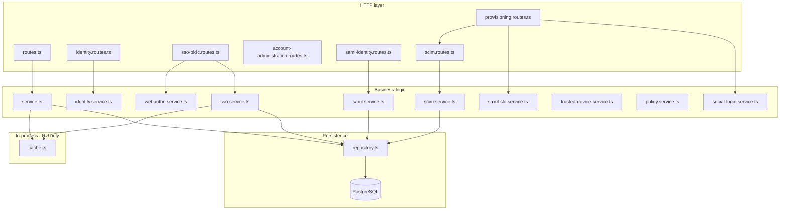

# Auth Module — Developer Reference

**Version:** 2.6.0+  
**Mount prefix:** `/auth` (plus `/scim/v2` for enterprise IdP provisioning)  
**Source:** `src/modules/auth/` and `src/modules/scim/`

This document is the canonical guide for engineers working on authentication, sessions, SSO, and SCIM.

| Doc | Purpose |
|-----|---------|
| **[AUTH_MODULE_FLOWS.md](./AUTH_MODULE_FLOWS.md)** | End-to-end flows, sequence diagrams, frontend integration |
| **AUTH_MODULE.md** (this file) | Routes, files, env vars, tables |
| **cursorauthchanges.md** | Release changelog |


---

## 1. Architecture overview



### Design principles

| Principle | Implementation |
|-----------|----------------|
| **Fail closed** | `authenticate` middleware rejects bad/missing tokens before handlers run |
| **No Redis in auth** | Ephemeral state (MFA challenges, OIDC state, rate limits, token blacklist) uses **LRU caches** in `cache.ts` |
| **Hashed secrets** | Refresh tokens, reset tokens, SCIM tokens stored as SHA-256 hashes |
| **httpOnly refresh cookie** | `__Host-refresh_token` — not returned in JSON after login |
| **Org-aware policy** | `policy.service.ts` enforces MFA/SSO/session timeout from organization settings |

### Multi-instance note

LRU blacklist and step-up freshness are **per process**. Revocation is still enforced via Postgres (`user_sessions.status`) on every request. After deploy or on another node, DB remains source of truth.

---

## 2. Route map (complete)

All paths below are relative to `/auth` unless noted.

### Health & policy

| Method | Path | Auth | Handler |
|--------|------|------|---------|
| GET | `/health` | Public | Module liveness |
| GET | `/password/policy` | Public | Password rules for UI |
| GET | `/policy/effective` | User | Merged org auth policy |
| GET | `/users/me/verification` | User | Email verification status |

### Registration & credentials

| Method | Path | Auth | Notes |
|--------|------|------|-------|
| POST | `/register`, `/users` | Public | Create account (alias) |
| POST | `/resend-verification` | Public | Rate limited |
| GET | `/verify-email` | Public | Email link target |
| POST | `/login` | Public | Password login → MFA challenge or session |
| POST | `/login/mfa` | Public | Complete TOTP/email MFA |
| POST | `/login/backup-code` | Public | Backup code login |
| POST | `/forgot-password`, `/password/forgot` | Public | Aliases |
| POST | `/reset-password`, `/password/reset` | Public | Consume reset token |
| POST | `/password/change` | User + step-up | Rotates sessions |

### SSO (OIDC + SAML)

| Method | Path | Auth | Notes |
|--------|------|------|-------|
| GET | `/sso/discovery?email=` | Public | OIDC/SAML/social hints |
| POST | `/sso/login` | Public | Starts OIDC or SAML (by `provider_id` or domain) |
| GET | `/sso/callback` | Public | OIDC callback (**API URL**) |
| GET | `/saml/metadata` | Public | SP metadata XML (requires `SAML_SP_CERTIFICATE`) |
| POST | `/saml/acs` | Public | SAML assertion consumer |
| POST | `/saml/logout` | User | Revokes session + returns IdP SLO URL |
| POST | `/saml/slo` | Public | SAML logout POST binding |

### Social OAuth login

| Method | Path | Auth | Notes |
|--------|------|------|-------|
| POST | `/login/social/:provider` | Public | Passwordless login (must be linked) |
| GET | `/login/social/callback` | Public | Social login callback (**API URL**) |

### WebAuthn & trusted devices

| Method | Path | Auth | File |
|--------|------|------|------|
| POST | `/mfa/webauthn/register/options` | User | `sso-oidc.routes.ts` |
| POST | `/mfa/webauthn/register/verify` | User + step-up | |
| POST | `/login/mfa/webauthn/options` | Public | Login MFA |
| POST | `/login/mfa/webauthn/verify` | Public | |
| POST | `/mfa/step-up/webauthn/options` | User | `account-administration.routes.ts` |
| POST | `/mfa/step-up/webauthn/verify` | User | |
| GET/POST/DELETE | `/trusted-devices` | User | Trust fingerprint / list / revoke |

### MFA (TOTP / email / backup)

| Method | Path | Auth |
|--------|------|------|
| POST | `/mfa/setup` | User |
| POST | `/mfa/verify-setup` | User |
| POST | `/mfa/challenge` | User |
| POST | `/mfa/verify` | User |
| POST | `/mfa/email/resend` | User |
| GET | `/mfa/devices` | User |
| PATCH | `/mfa/devices/:id` | User (rename) |
| DELETE | `/mfa/devices/:id` | User + step-up |
| PATCH | `/mfa/devices/:id/primary` | User + step-up |
| POST | `/mfa/backup-codes` | User + step-up |
| POST | `/mfa/toggle` | User |
| POST | `/mfa/disable/request` | User + step-up |
| POST | `/mfa/disable/confirm` | Public (token) |

### Sessions

| Method | Path | Auth | Notes |
|--------|------|------|-------|
| GET | `/sessions` | User | List active sessions |
| GET | `/sessions/:id` | User | Session detail |
| DELETE | `/sessions` | User | Revoke **all** (clears cookie) |
| DELETE | `/sessions/others` | User | Revoke all except current |
| DELETE | `/sessions/:id` | User | Revoke one (not current) |
| POST | `/sessions/refresh` | Cookie | Rotate refresh token |
| POST | `/logout` | User | Revoke current; returns `{ saml_logout_url }` if SAML |

### User profile & admin

| Method | Path | Auth |
|--------|------|------|
| GET/PATCH/DELETE | `/users/me` | User |
| GET | `/users/me/security-summary` | User |
| GET | `/users/me/export` | User + step-up |
| GET | `/users`, `/users/:id` | Admin |
| POST | `/users/:id/restore`, `/suspend`, `/unsuspend`, `/lock`, `/unlock` | Admin |
| POST | `/users/:id/password/reset` | Admin |
| DELETE | `/users/:id/sessions` | Admin |
| GET | `/users/:id/audit-events` | Admin |

### Compliance & account lifecycle

| Method | Path | Auth |
|--------|------|------|
| POST | `/account/unlock/request`, `/confirm` | Public |
| POST | `/users/me/delete/request` | User + step-up |
| POST | `/users/me/delete/confirm` | Public |
| POST | `/mfa/recovery/request` | User + step-up |

### SCIM 2.0 (dual mount)

Registered at:

- `/scim/v2/:orgId/*` (standard — `auth.module.ts`)
- `/auth/scim/v2/:orgId/*` (alias — `provisioning.routes.ts`)

| Method | Path | Auth |
|--------|------|------|
| GET | `.../ServiceProviderConfig` | SCIM bearer |
| GET | `.../ResourceTypes`, `.../Schemas` | SCIM bearer |
| GET/POST | `.../Users` | SCIM bearer |
| GET/PUT/PATCH/DELETE | `.../Users/:id` | SCIM bearer |
| GET | `.../Groups`, `.../Groups/:id` | SCIM bearer (roles: member, admin, owner) |

Tokens: created via `POST /organizations/:orgId/scim-tokens` (org module), prefix `scim_`, hashed in DB.

---

## 3. Core flows

### 3.1 Password login

1. `POST /auth/login` → `service.loginWithEmailPassword`
2. If MFA required → returns `challenge_id` (state in `loginMfaChallengeCache`)
3. Trusted device fingerprint may skip MFA (`trusted-device.service.ts`)
4. `POST /auth/login/mfa` or WebAuthn login MFA routes complete flow
5. `issueSessionForUser` → INSERT session + set refresh cookie

### 3.2 OIDC SSO

1. `POST /auth/sso/login` → `sso.service.startSsoLogin` (PKCE state in `oidcLoginStateCache`)
2. IdP redirects to **`{API_PUBLIC_URL}/auth/sso/callback`**
3. `completeSsoCallback` → JIT via `sso-provision.service.ts` if enabled
4. `finalizeEnterpriseSsoLogin` → session with `login_method: oidc`, `sso_provider_id`

### 3.3 SAML SSO

1. Same entry `POST /auth/sso/login` when provider type is SAML or domain matches SAML provider
2. `saml.service.startSamlLogin` → HTTP-Redirect to IdP
3. IdP POSTs to `/auth/saml/acs` → validates assertion, stores `saml_name_id` + `saml_session_index` on session

### 3.4 SAML logout

1. `POST /auth/logout` or `POST /auth/saml/logout` → if session has SAML context, `completeSamlLogoutForUser` revokes locally then returns IdP logout URL
2. IdP may POST `SAMLRequest` / `SAMLResponse` to `/auth/saml/slo` → `saml-xml.util.ts` parses NameID; sessions revoked by `saml_name_id`

### 3.5 Social login

1. User must have linked provider (`user_linked_identities`)
2. `POST /auth/login/social/:provider` → OAuth with `socialLoginStateCache`
3. Callback at **`{API_PUBLIC_URL}/auth/login/social/callback`**
4. Unknown/unlinked subject → `INVALID_CREDENTIALS` (enumeration-safe)

### 3.6 Step-up MFA

Sensitive routes use `requireStepUp` middleware (checks `stepUpFreshnessCache`).

- TOTP/email: `POST /mfa/challenge` then `POST /mfa/verify`
- Passkey: `POST /mfa/step-up/webauthn/options` + `/verify`

### 3.7 Session refresh

`POST /auth/sessions/refresh` reads signed cookie, rotates refresh hash in DB, issues new access JWT. Re-checks org policy and idle timeout.

---

## 4. OAuth redirect URIs (register in IdP consoles)

Configured in `oauth-callback.config.ts` — always use **API host**:

| Flow | Callback URL |
|------|----------------|
| OIDC SSO | `{API_PUBLIC_URL}/auth/sso/callback` |
| Social login | `{API_PUBLIC_URL}/auth/login/social/callback` |

Set `API_PUBLIC_URL` in every deployed environment.

---

## 5. Environment variables

| Variable | Purpose |
|----------|---------|
| `API_PUBLIC_URL` | OAuth/SAML SP public URLs |
| `FRONTEND_URL` / `APP_URL` | Email links, post-logout redirect |
| `GOOGLE_*`, `GITHUB_*`, `MICROSOFT_*` | Social OAuth |
| `SAML_SP_ENTITY_ID`, `SAML_SP_ACS_URL`, `SAML_SP_SLO_URL` | SAML SP endpoints |
| `SAML_SP_CERTIFICATE`, `SAML_SP_PRIVATE_KEY` | Metadata + signing |
| `WEBAUTHN_RP_ID`, `WEBAUTHN_RP_NAME` | Passkeys |
| `AUTH_EMAIL_ASYNC` | Queue emails to `auth_email_outbox` |

---

## 6. File map

| File | Responsibility |
|------|----------------|
| `routes.ts` | Core credentials, users, MFA, sessions |
| `identity.routes.ts` | Policy, discovery, compliance |
| `sso-oidc.routes.ts` | OIDC SSO, WebAuthn register/login MFA, trusted devices |
| `account-administration.routes.ts` | WebAuthn step-up, MFA rename, admin password reset |
| `saml-identity.routes.ts` | SAML ACS/metadata |
| `provisioning.routes.ts` | Social login, SAML SLO, SCIM under `/auth/scim/v2` |
| `service.ts` | Login, register, MFA, sessions, admin users |
| `identity.service.ts` | Email change, unlock, deletion, export, discovery |
| `repository.ts` | All SQL for users, sessions, SSO, SCIM mappings |
| `cache.ts` | **LRU caches** — do not replace with Redis without platform decision |
| `policy.service.ts` | Org policy merge + login/refresh enforcement |
| `sso.service.ts` | OIDC PKCE |
| `saml.service.ts` | SAML SP login + metadata |
| `saml-slo.service.ts` | Single logout |
| `saml-xml.util.ts` | Logout XML parsing |
| `oauth-callback.config.ts` | Canonical API callback URLs |
| `oauth-exchange.ts` | Shared OAuth token exchange |
| `scim/scim.service.ts` | SCIM Users + Groups |
| `scim/scim.routes.ts` | SCIM route registrar |
| `scim/scim.middleware.ts` | Bearer token auth |
| `auth.module.ts` | Registers `/auth` + `/scim/v2` |

---

## 7. Database tables (auth-owned or used)

| Table | Use |
|-------|-----|
| `users` | Accounts |
| `user_sessions` | Sessions (+ SSO/SAML columns) |
| `user_mfa_devices` | TOTP, email, WebAuthn, backup codes |
| `user_trusted_devices` | MFA skip fingerprint |
| `user_linked_identities` | Google/GitHub/Microsoft links |
| `organization_sso_providers` | OIDC/SAML per org |
| `organization_members` | SCIM membership + roles |
| `organization_scim_tokens` | SCIM bearer hashes |
| `scim_user_mappings` | ExternalId ↔ user |
| `auth_email_outbox` | Async email queue |

Migrations: `011`–`014` in `src/db/postgres/migrations/`.

---

## 8. Error codes

See `types.ts` → `AuthErrorCodes`. Common:

- `INVALID_CREDENTIALS`, `MFA_REQUIRED`, `STEP_UP_REQUIRED`
- `SSO_REQUIRED`, `OIDC_NOT_CONFIGURED`, `SAML_*`
- `IDENTITY_*`, `SOCIAL_LOGIN_FAILED`
- `SCIM_UNAUTHORIZED`, `SCIM_NOT_FOUND`, `SCIM_CONFLICT`

---

## 9. Workers

| Worker | File | Job |
|--------|------|-----|
| Auth cleanup | `workers/auth-cleanup.processor.ts` | Account deletion grace, `processAuthEmailOutbox()` |

---

## 10. Testing & operations

```bash
npm run build
npm run test
npm run db:migrate   # applies 011–014 auth migrations
```

**Checklist for new environments**

1. Set `API_PUBLIC_URL` and register OAuth callbacks.
2. Configure SAML cert (metadata endpoint returns 503 without it).
3. Create SCIM token in org settings for IdP provisioning.
4. Run auth-cleanup worker if using async email.

---

## 11. Known limitations (by design)

- No OIDC RP-initiated logout (`end_session_endpoint`) — SAML SLO only for federated logout.
- SCIM Groups are read-only mirrors of org roles (`member`, `admin`, `owner`).
- CAPTCHA / risk-based login not implemented.
- Password policy is global (not per-tenant) in `policy.service.ts`.

---

*Last updated: 2026-06-01 — aligns with auth module 2.6.0 enterprise fixes.*
