# Auth Module — End-to-End Flows

**Version:** 2.6.1  
**Companion doc:** [`AUTH_MODULE.md`](./AUTH_MODULE.md) (routes, files, env vars)  
**Code:** `src/modules/auth/`, `src/modules/scim/`

This document explains **what happens step by step** when a user or system interacts with auth. Read it when onboarding, debugging a login issue, or designing a frontend integration.

---

## How this doc differs from `AUTH_MODULE.md`

| Document | Best for |
|----------|----------|
| **AUTH_MODULE.md** | Lookup: routes, tables, env vars, file map |
| **AUTH_MODULE_FLOWS.md** (this file) | Understanding sequences, decisions, and state |

---

## 1. Token and session model

Every successful sign-in creates **one row** in `user_sessions` and two tokens:

| Artifact | Where it lives | Lifetime | Purpose |
|----------|----------------|----------|---------|
| **Access JWT** | JSON response body | ~15 min | `Authorization: Bearer …` on API calls |
| **Refresh JWT** | httpOnly cookie `__Host-refresh_token` | 24h (or 30d with `remember_me`) | `POST /auth/sessions/refresh` only |

The access JWT’s `jti` claim equals the **session UUID**. That same ID is stored in Postgres.

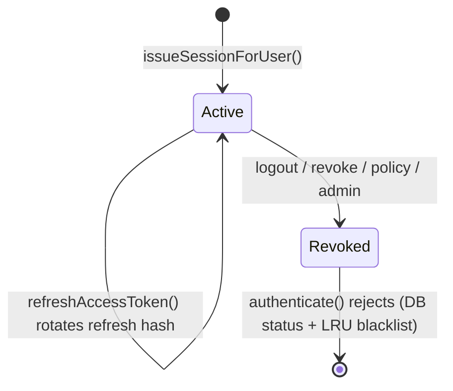

**After login**, the browser should:

1. Store the access token in memory (or secure storage).
2. Rely on the **cookie** for refresh — do not persist refresh token in `localStorage`.

---

## 2. Every authenticated API request

All routes using the `authenticate` middleware follow the same gate (`shared/middleware/auth.ts`):

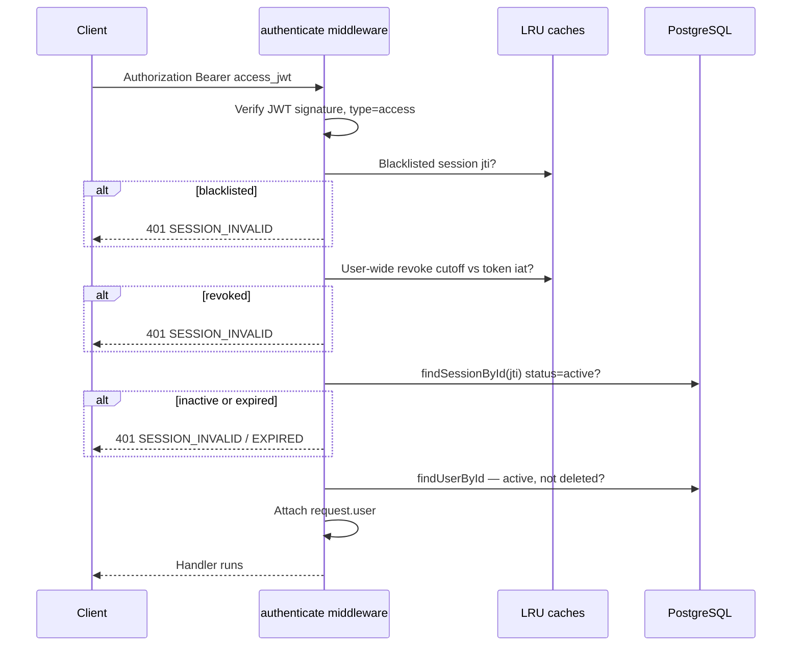

**Step-up routes** add `requireStepUp`: the session must have a recent entry in `stepUpFreshnessCache` (after `POST /auth/mfa/verify` or WebAuthn step-up).

---

## 3. Registration and email verification

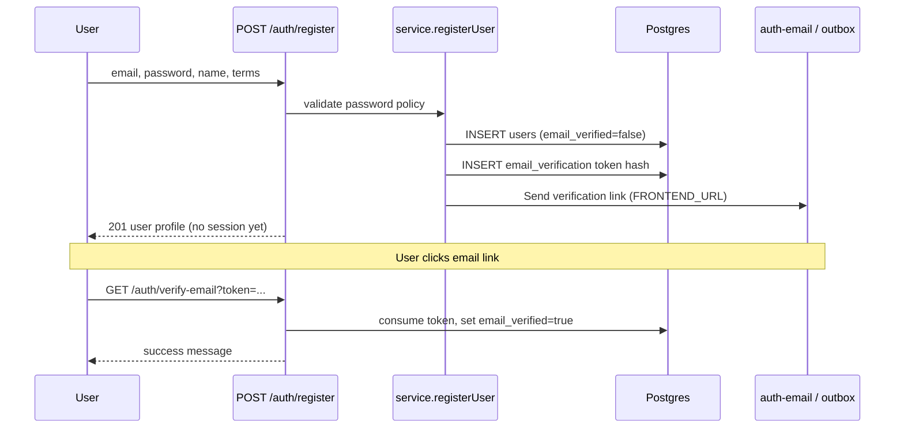

**Important:** Unverified users who try password login get the same `INVALID_CREDENTIALS` response as a wrong password (anti-enumeration). A new verification email may be sent silently.

**Status check (no enumeration):** `GET /auth/users/me/verification` (authenticated) returns `{ email_verified, email_verified_at }`.

---

## 4. Password login (full path)

### 4.1 High-level decision

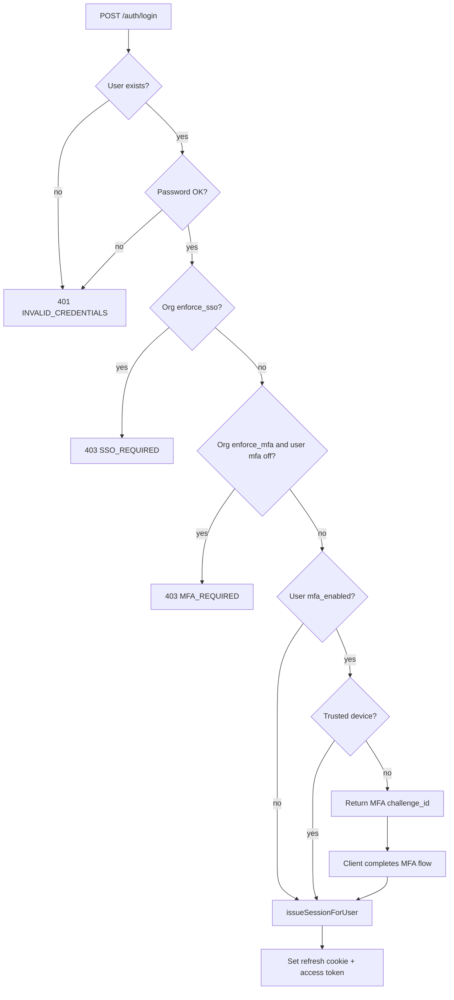

### 4.2 Sequence (with MFA)

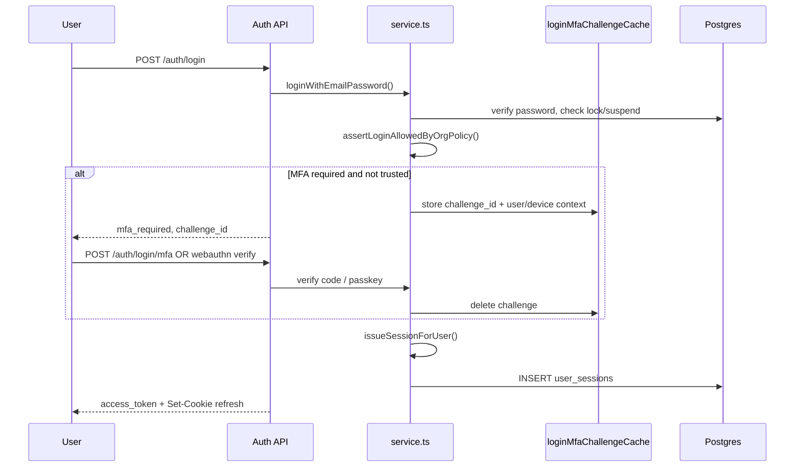

### 4.3 Trusted device skip

If the user previously called `POST /auth/trusted-devices` (requires step-up) and the device fingerprint matches, MFA is skipped on password login for **30 days** (`trusted-device.service.ts`).

---

## 5. Choosing a sign-in method (frontend)

Before showing a login form, call:

`GET /auth/sso/discovery?email=user@company.com`

Response drives the UI:

| Field | Meaning |
|-------|---------|
| `oidc_login_ready` | Domain has OIDC IdP → show “Sign in with SSO” |
| `saml_login_ready` | Domain has SAML IdP → same button, backend picks SAML |
| `sso_available` | List of org providers (metadata for picker) |
| `social_login_ready` | Google/GitHub/Microsoft configured on server |
| `linked_social_providers` | Which social buttons this **email** can use (already linked) |
| `configured_link_providers` | Which providers exist globally (for “link account” settings) |

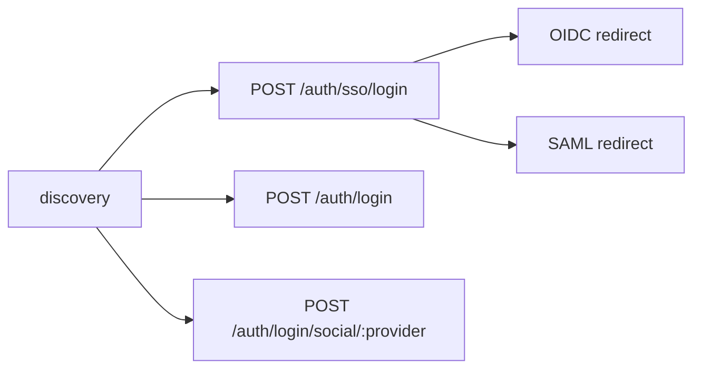

---

## 6. Enterprise SSO — OIDC flow

**Start:** `POST /auth/sso/login` with `email` or `provider_id`  
**Service:** `sso.service.ts` (PKCE)

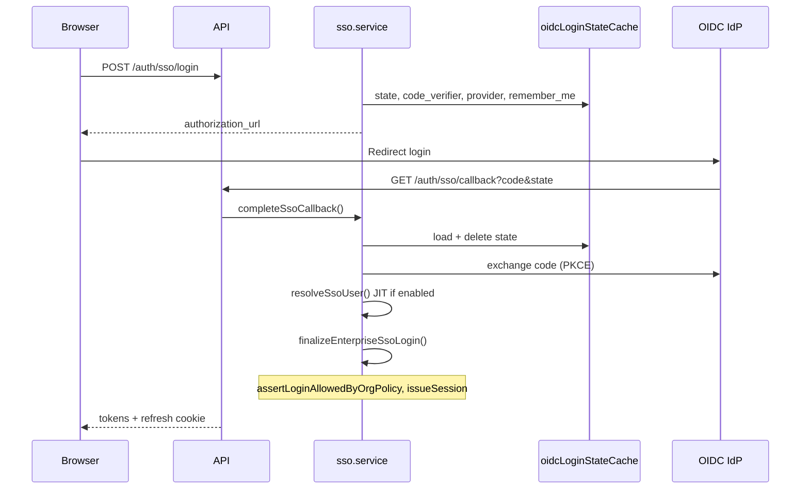

**Callback URL (register at IdP):** `{API_PUBLIC_URL}/auth/sso/callback`

**JIT provisioning:** When `oidc_jit_provision` is true on the org provider, unknown emails create a user + org membership (`sso-provision.service.ts`). Domain must match provider `domain` when set.

---

## 7. Enterprise SSO — SAML flow

**Start:** Same `POST /auth/sso/login` — router delegates to `saml.service.ts` when `provider_type === 'saml'` or domain matches SAML provider.

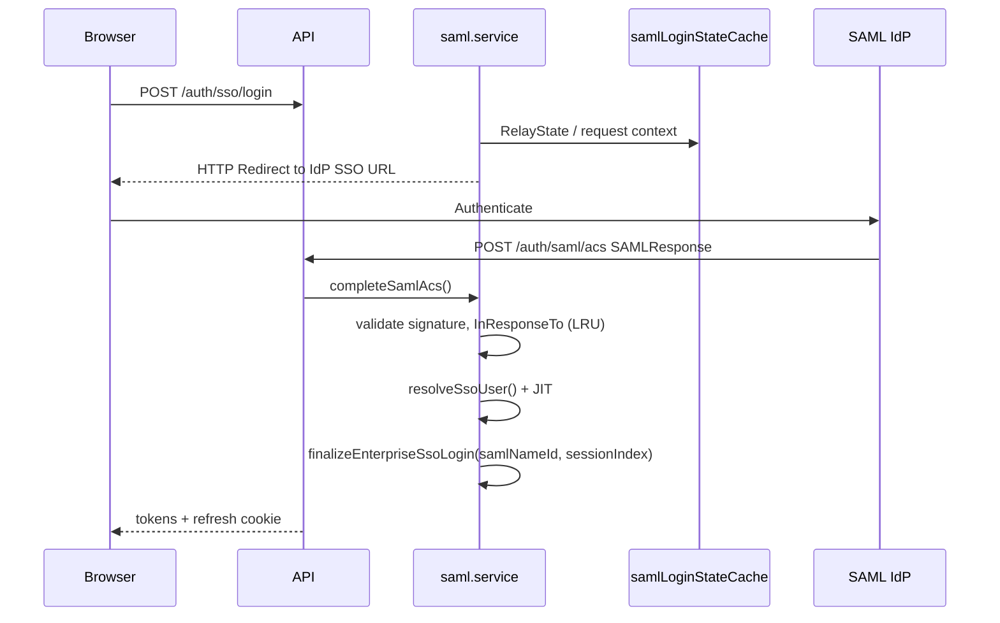

**SP metadata for IdP admin:** `GET /auth/saml/metadata` (requires `SAML_SP_CERTIFICATE`).

**Session fields for logout:** `saml_name_id`, `saml_session_index`, `sso_provider_id` on `user_sessions`.

---

## 8. Social login (passwordless)

**Prerequisite:** User already linked provider via identity linking (while logged in).

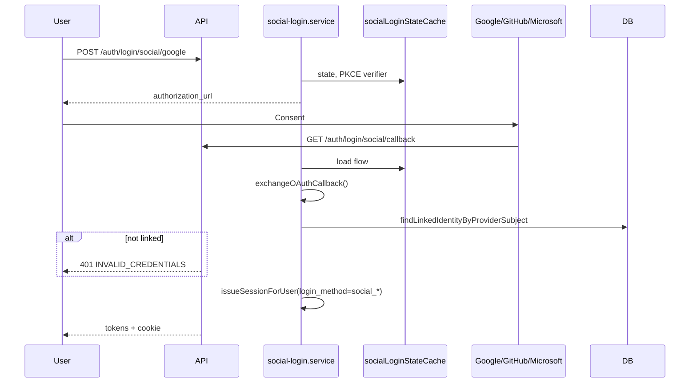

**Callback URL:** `{API_PUBLIC_URL}/auth/login/social/callback`

---

## 9. Identity linking (authenticated)

Used from account settings — **not** a login method by itself.

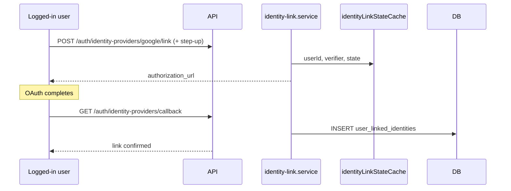

**Callback URL:** `{API_PUBLIC_URL}/auth/identity-providers/callback`

---

## 10. Session refresh and logout

### 10.1 Refresh

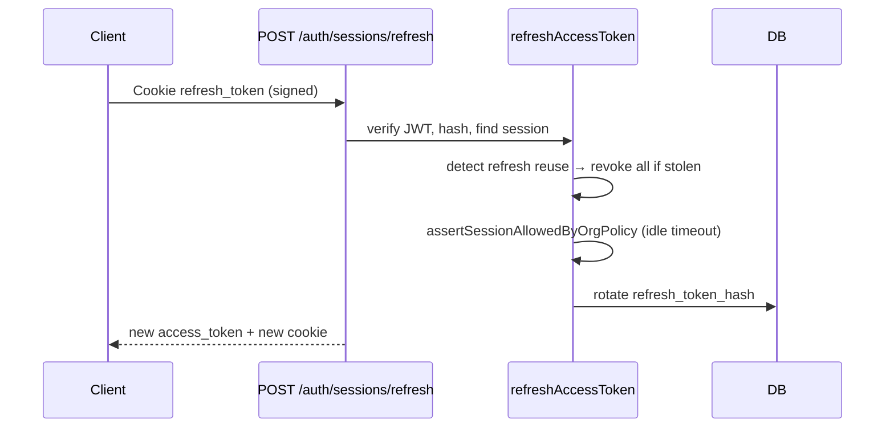

### 10.2 Logout (password / OIDC / social session)

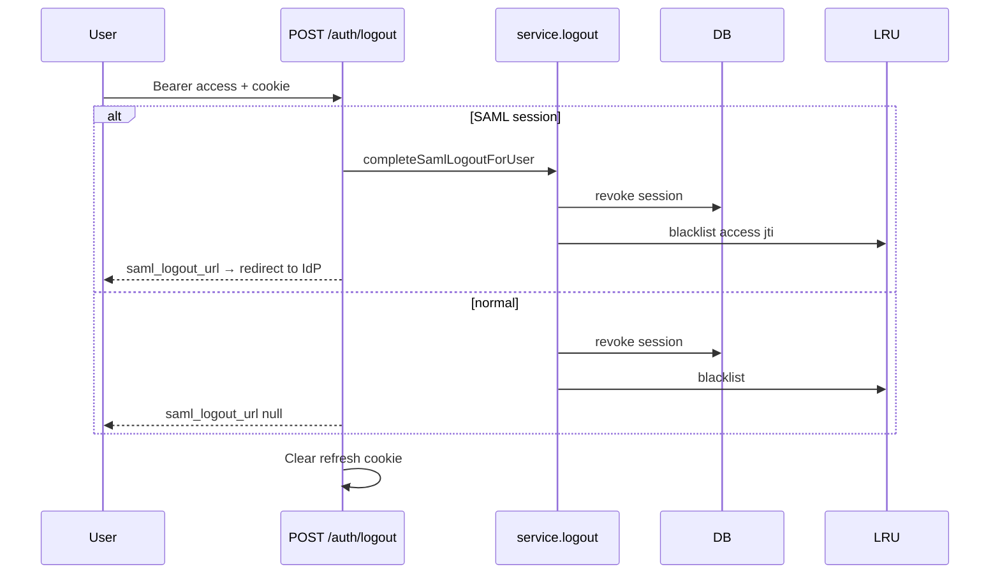

### 10.3 SAML single logout (IdP-initiated)

IdP POSTs `SAMLRequest` to `POST /auth/saml/slo`:

1. Parse XML → `NameID`, `Issuer` (`saml-xml.util.ts`).
2. Resolve SAML provider (session or `entity_id`).
3. Validate request, revoke all sessions with that `saml_name_id`.
4. Return `SAMLResponse` redirect to IdP.

---

## 11. Step-up MFA (in-session sensitive actions)

Required for: password change, MFA disable, device removal, email change, account deletion export, identity link/unlink, etc.

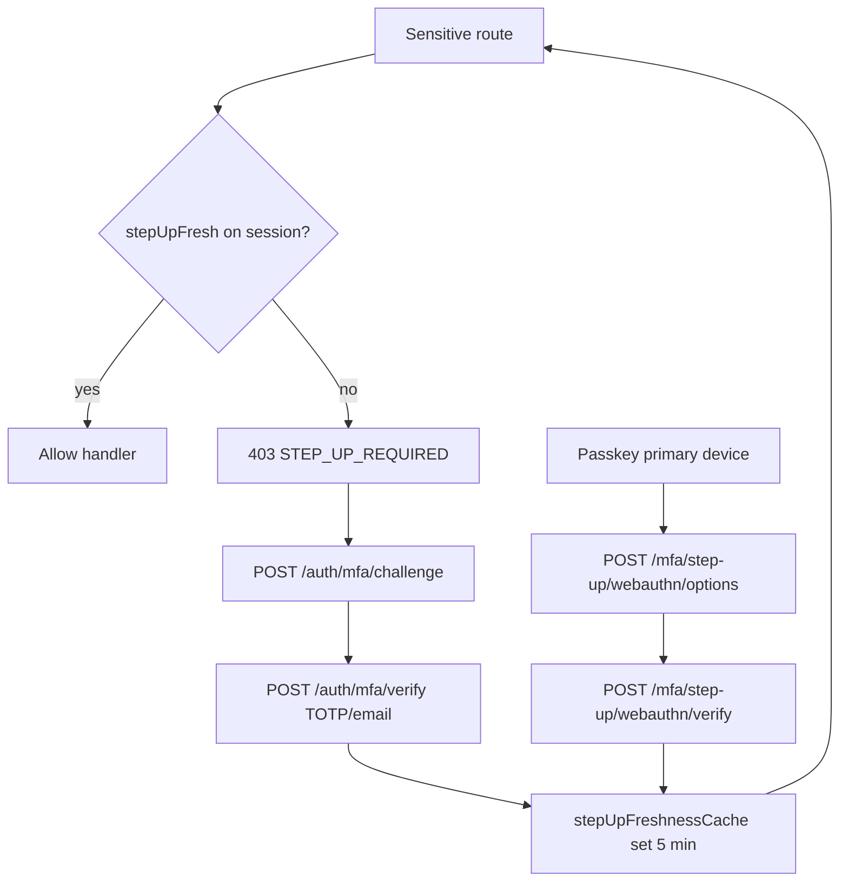

---

## 12. Organization policy enforcement

Policy is loaded from **all active org memberships**; strictest rule wins (`policy.service.ts`).

| Policy flag | When checked | Effect |
|-------------|--------------|--------|
| `enforce_sso` | After password login succeeds | Block if user has password (`SSO_REQUIRED`) |
| `enforce_mfa` | After primary auth | Block if MFA not enabled (`MFA_REQUIRED`) |
| `session_timeout_minutes` | On refresh | Revoke if `last_active_at` too old |

SSO logins (OIDC/SAML/social) call `assertLoginAllowedByOrgPolicy` before issuing a session.

---

## 13. SCIM provisioning (IdP → your app)

**Auth:** `Authorization: Bearer scim_…` (token from org admin UI)  
**Mounts:** `/scim/v2/:orgId/...` and `/auth/scim/v2/:orgId/...`

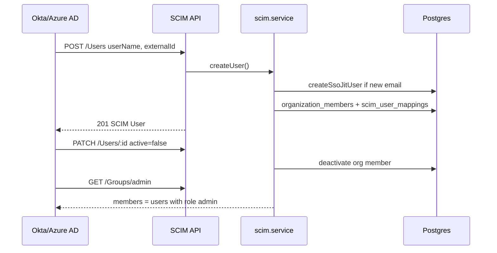

**Groups** are read-only views of org roles: `member`, `admin`, `owner`.

---

## 14. Account lifecycle flows

| Flow | Start | Confirm | Outcome |
|------|-------|---------|---------|
| Forgot password | `POST /auth/password/forgot` | `POST /auth/password/reset` | New password; all sessions revoked |
| Account unlock | `POST /auth/account/unlock/request` | `POST /auth/account/unlock/confirm` | Clears `locked_until` |
| Email change | `POST /auth/email/change/request` (+ step-up) | `POST /auth/email/change/confirm` | Updates email |
| Account deletion | `POST /auth/users/me/delete/request` | `POST /auth/users/me/delete/confirm` | Schedules deletion (7-day grace); worker purges |
| MFA recovery | `POST /auth/mfa/recovery/request` | Manual support | Security event + audit only |

Token confirm endpoints share `tokenConfirmRateLimit` (LRU per IP).

---

## 15. Ephemeral state (LRU) — what lives where

| Cache | Key | TTL | Used in flow |
|-------|-----|-----|----------------|
| `loginMfaChallengeCache` | challenge_id | 5 min | Password login MFA |
| `stepUpChallengeCache` | challenge_id | 5 min | Step-up verify |
| `stepUpFreshnessCache` | session_id | 5 min | After step-up success |
| `oidcLoginStateCache` | state | 10 min | OIDC SSO |
| `socialLoginStateCache` | state | 10 min | Social login |
| `identityLinkStateCache` | state | 10 min | Link account |
| `samlLoginStateCache` | state | 10 min | SAML login |
| `accessTokenBlacklistCache` | session_id | 15 min | Logout / revoke |
| `userRevokeCache` | user_id | 15 min | Password reset, etc. |

**Not in LRU:** refresh tokens, sessions, users — always Postgres.

---

## 16. Frontend integration checklist

1. **Discovery** — `GET /auth/sso/discovery?email=` on email blur.
2. **Login** — branch on `mfa_required`; store `challenge_id` only in memory.
3. **Tokens** — access in memory; refresh via cookie + `POST /auth/sessions/refresh` before expiry.
4. **Logout** — `POST /auth/logout`; if `saml_logout_url` present, redirect browser to IdP.
5. **401 handling** — on `SESSION_INVALID`, redirect to login; try one refresh if access expired.
6. **Step-up** — on `STEP_UP_REQUIRED`, run MFA challenge flow then retry original request.
7. **OAuth apps** — register API callback URLs from `oauth-callback.config.ts` (not SPA URL unless you proxy).

---

## 17. Debugging guide

| Symptom | Likely cause | Check |
|---------|--------------|-------|
| MFA challenge “expired” after deploy | LRU lost on restart | User re-logs in; expected in multi-instance without sticky sessions |
| OIDC “invalid state” | Wrong node / expired state | Same as above; verify `API_PUBLIC_URL` |
| OAuth redirect mismatch | Callback URL not registered | IdP console vs `oauth-callback.config.ts` |
| SAML ACS error | Cert/issuer/ACS URL | IdP config vs `organization_sso_providers` |
| SSO works but password blocked | `enforce_sso` | `GET /auth/policy/effective` |
| Refresh fails immediately | Cookie path / Secure / domain | Browser devtools → Application → Cookies |
| SCIM 401 | Wrong org in URL or revoked token | `organization_scim_tokens` |

---

*For route tables and file index, see [`AUTH_MODULE.md`](./AUTH_MODULE.md). For release history, see `cursorauthchanges.md`.*
