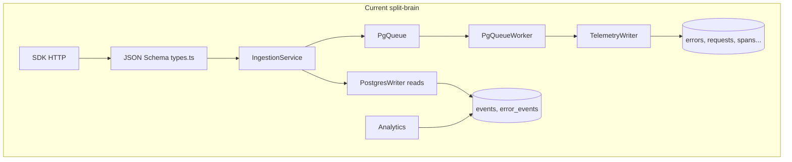
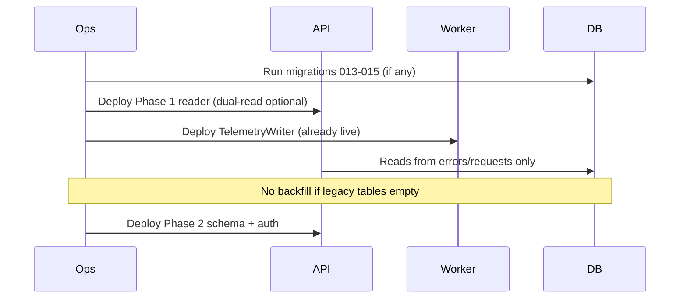

# Backend Remediation — High-Level Design Plan

**Scope:** `api-monitoring-backend` (v2.0.0)  
**Date:** 2026-06-01  
**Status:** In progress — Phase 1–3 (ingestion) implemented 2026-06-01  
**Prior audits:** Full backend (~6.5/10), ingestion module (~5.5/10)

This plan addresses findings from architecture review: split storage layers, ingestion schema drift, security IDOR gaps, connection pooling, missing tests, and ops hygiene.

---

## 1. Goals & success criteria

| Goal | Success metric |
|------|----------------|
| **Single source of truth for telemetry** | All writes and reads use migrations `013`/`014` tables (`errors`, `requests`, `spans`, …) |
| **SDK parity** | All 10 `SdkEventType` values ingestable via HTTP with validated schemas |
| **Tenant safety** | Every project-scoped read uses `requireProjectMembership` (same as analytics) |
| **Predictable limits** | Rate limits enforced per event (or weighted batch), documented in API responses |
| **Production ops** | PgBouncer (or equivalent), tuned pool sizes, CI + integration tests on ingestion |
| **No silent data loss** | Poison queue jobs → DLQ or failed state, not `complete` with zero writes |

**Target ratings after execution:**

| Area | Current | Target |
|------|---------|--------|
| Ingestion module | 5.5/10 | **8.5/10** |
| Full backend | 6.5/10 | **8/10** |

---

## 2. Problem summary (root causes)



1. **Storage bifurcation** — Write path (`TelemetryWriter`) ≠ read path (`PostgresWriter`, `AnalyticsRepository`).
2. **Validation bifurcation** — `types.ts` JSON Schema ≠ `event-normalizer.ts` Zod.
3. **Authorization gap** — Ingestion reads use JWT only; analytics uses JWT + tenant middleware.
4. **Rate limiting semantics** — One token per HTTP batch, not per event.
5. **Platform ops** — Duplicate `pg` pools, PM2 `instances: max`, no PgBouncer, no automated tests.

---

## 3. Design principles

1. **One canonical event model** — `event-normalizer.ts` (`SdkEventType`, `NormalizedEvent`) is the contract; HTTP schemas are generated from or validated by the same Zod definitions.
2. **One persistence adapter per concern** — `TelemetryWriter` (writes), `TelemetryReader` (reads), no duplicate legacy writers.
3. **Fail closed on auth** — Project ID from URL/query must pass membership check before any row access.
4. **At-least-once with explicit failure** — Queue jobs that persist zero rows after valid enqueue must not auto-complete.
5. **Phased delivery** — Fix data path and security before polish (OpenAPI, ClickHouse).

---

## 4. Phase 0 — Foundations (1–2 days)

**Objective:** Safe deploys and visibility before schema/route changes.

| Task | Design choice |
|------|----------------|
| `.gitignore` | Add `.env`, `dist/`, `logs/`, `node_modules` |
| `README.md` | Boot order: migrate → API → workers; env vars; Railway + PgBouncer note |
| `ecosystem.config.cjs` | `env_production.NODE_ENV=production`; document worker process separate from PM2 |
| CI workflow | `npm run build`, `npm run lint`, `vitest` (once tests exist) |
| Env split | `DATABASE_URL` (pooler), `DATABASE_URL_DIRECT` (migrations only) |

**No user-facing API changes.**

---

## 5. Phase 1 — Storage unification (critical, 3–5 days)

### 5.1 Canonical data model

**Decision:** Deprecate `events`, `error_events`, `request_events` for runtime. Keep `schema4log.sql` as historical reference only.

| Event type | Write table | Read table | Primary key / id |
|------------|-------------|------------|------------------|
| error | `errors` | `errors` | `id` + `timestamp` |
| request | `requests` | `requests` | `id` + `timestamp` |
| span | `spans` | `spans` | composite |
| trace | `traces` | `traces` | `project_id, trace_id, timestamp` |
| metric | `metrics` | `metrics` | `id` + `timestamp` |
| log | `logs` | `logs` | `id` + `timestamp` |
| message | `messages` | `messages` | `id` + `timestamp` |
| profile | `profiles` | `profiles` | `id` + `timestamp` |
| cron_checkin | `cron_checkins` | `cron_checkins` | `id` + `timestamp` |
| replay | `replays` | `replays` | `id` + `timestamp` |

### 5.2 New module layout

```
src/modules/ingestion/
  domain/
    event-types.ts          # SdkEventType, limits (move from event-normalizer exports)
  pipeline/
    event-normalizer.ts     # unchanged contract
    telemetry-writer.ts     # writes only
    telemetry-reader.ts     # NEW: list/get/debug/replay reads
  persistence/
    postgres-writer.ts      # rename from postgress.writter; API key auth only
  service.ts
  controller.ts
  routes.ts
  types.ts                  # HTTP DTOs only; derive schemas from Zod
```

**`PostgresWriter` responsibilities after refactor:**

- `getProjectByApiKeyHash`, `updateApiKeyLastUsed`, `healthCheck`
- Delegate reads to `TelemetryReader`

**Remove:** `writeEvents`, `writeRequestEvents`, `writeErrorEvents` (legacy), or guard behind feature flag until migration verified.

### 5.3 Read API redesign

| Endpoint | New data source |
|----------|-----------------|
| `GET /v1/errors` | `SELECT … FROM errors WHERE project_id = $1` |
| `GET /v1/errors/:id` | `errors.id` (document partition key if needed) |
| `GET /v1/debug/events/:id` | Union lookup: query `errors`, `requests`, `spans`, … by `id` + `project_id` |
| `POST /v1/replay` | `TelemetryReader.getEventsForReplay()` reading typed tables (or single `telemetry_events` view — see 5.4) |

### 5.4 Optional: unified read view (recommended for replay/debug)

```sql
CREATE VIEW telemetry_events_unified AS
  SELECT id, project_id, org_id, 'error' AS type, timestamp, … FROM errors
  UNION ALL
  SELECT id, project_id, org_id, 'request' AS type, timestamp, … FROM requests
  …;
```

**Tradeoff:** View simplifies replay; per-table queries are easier to index. **Recommendation:** Per-table reader methods first; add view only if replay SQL becomes unwieldy.

### 5.5 Analytics module alignment (same phase)

`AnalyticsRepository` still queries `events` / `error_events`. **Must** migrate to `errors`, `requests`, `error_groups` (014) in parallel — otherwise UI stays empty while ingestion works.

**Acceptance:** Integration test inserts error via `/v1/ingest/errors` → worker persists → `GET /v1/errors` returns row within N seconds.

---

## 6. Phase 2 — HTTP contract & SDK parity (2–3 days)

### 6.1 Single validation pipeline

**Decision:** Replace hand-written `IngestSchema` JSON Schema with Zod → JSON Schema conversion (`zod-to-json-schema` or Fastify Zod provider already in use).

```typescript
// types.ts (conceptual)
import { eventSchema, z } from './pipeline/event-normalizer.js';

export const IngestBodySchema = z.object({
  apiKey: z.string().min(32).max(128),
  events: z.array(eventSchema).min(1).max(env.INGESTION_MAX_BATCH_SIZE),
  metadata: z.object({ … }).optional(),
});
```

**Effects:**

- `span`, `trace`, `message`, etc. accepted on `/v1/ingest`
- Metric field names match normalizer (`metricName`, `metricType`)
- Remove invalid enum value `custom` OR add `custom` to normalizer with explicit handling

### 6.2 Routes

| Route | Action |
|-------|--------|
| `POST /v1/ingest` | Keep — all types |
| `POST /v1/ingest/:signal` | Optional thin aliases (`errors`, `requests`, …) mapping to `expectedType` |
| Deprecated | None in v2; document breaking change in CHANGELOG |

### 6.3 API key transport

**Decision:** Support **header-first**, body fallback (deprecation window).

1. `X-API-Key` or `Authorization: Bearer <project_key>`
2. `body.apiKey` — log deprecation warning

Apply to: `init`, all `ingest/*`.

### 6.4 Limits endpoint

**Decision:** Split into two endpoints:

| Endpoint | Auth | Purpose |
|----------|------|---------|
| `GET /v1/limits` | API key header only | SDK runtime |
| `GET /v1/ingest/health` | JWT + admin optional detail | Operators |

Remove JWT requirement from SDK limits route.

### 6.5 Response shape

Populate `IngestResponse.limits` from `RateLimitDecision`:

```typescript
limits: {
  remaining: decision.perMinuteRemaining,
  resetAt: nextMinuteBoundaryMs,
}
```

Document `rejected` reasons: `validation_failed`, `shed_backpressure`, `deduped`, `wrong_type`.

---

## 7. Phase 3 — Security & rate limits (2 days)

### 7.1 Tenant middleware

Apply to all project-scoped ingestion routes:

```typescript
preHandler: [authenticate, requireProjectMembership]
```

**Project ID resolution:**

- `GET /v1/errors?projectId=` → middleware reads `projectId` from query (extend `tenant.ts` if needed)
- `GET /v1/errors/:errorId?projectId=` → same
- `GET /v1/debug/events/:id?projectId=` → same
- `POST /v1/replay` → validate `body.projectId` membership before enqueue

### 7.2 Rate limiting

**Decision:** Weighted batch consumption.

```typescript
const weight = jobs.length; // or events.length
const decision = rateLimiter.tryConsume(projectId, perSecond, perMinute, weight);
```

**Alternative:** Loop per event (accurate, hotter path) — use only if profiling shows batch weight is insufficient.

**Cluster fairness (phase 3b):** Optional Redis token bucket keyed by `projectId` for exact cross-PM2 limits (reuse existing Redis).

### 7.3 Queue job integrity

```typescript
// ingestion-job-handler.ts
if (scoped.length === 0) {
  throw new Error('NO_PERSISTABLE_EVENTS'); // → retry/DLQ, not complete
}
```

Distinguish **poison** (permanent validation fail) vs **transient** DB errors.

### 7.4 Admin operations

- DLQ list: optional `projectId` filter + audit log entry on reprocess
- Replay: require admin + log `{ projectId, replayId, count }`

---

## 8. Phase 4 — Platform & connection management (1–2 days)

| Item | Design |
|------|--------|
| Railway / prod | PgBouncer template; app `DATABASE_URL` → pooler; migrations → direct URL |
| Pool sizing | API: `max: 5–10` per process; workers: `max: 10–15`; remove duplicate `log-database` pool on same URL or disable until `LOG_DB_PRIMARY` set |
| PM2 | `instances: 2–4` fixed OR pooler + `max` with low `pg` max |
| Workers in deploy | Separate Railway service running `node dist/workers/main.js` (compose already models this) |

---

## 9. Phase 5 — Testing & observability (3–4 days)

### 9.1 Test pyramid

| Layer | Coverage |
|-------|----------|
| Unit | `normalizeEvent`, rate limiter weights, `shouldShed`, dedupe key format |
| Integration | testcontainers Postgres: enqueue → claim → `writeBatch` → read API |
| E2E smoke | `POST /v1/ingest/errors` → poll `GET /v1/errors` |

### 9.2 Metrics (ingestion)

- `ingestion_events_accepted_total{project_id,type}` (cardinality cap)
- `ingestion_queue_depth`, `ingestion_dlq_total`
- `ingestion_rate_limit_rejected_total`

### 9.3 Health

`/v1/health` degraded if `pendingDepth > highWater` or oldest pending age > threshold.

---

## 10. Phase 6 — Cleanup & deprecation (1 day)

| Remove / fix | Reason |
|--------------|--------|
| `bullmq` dependency | Unused after pg-queue |
| Unused `@fastify/swagger` or wire `/docs` | Dead deps |
| `CIRCUIT_OPEN` error code | Implement with `opossum` on DB or remove |
| `allowedEventTypes` | Enforce or delete from cache |
| Rename `postgress.writter.ts` → `postgres-writer.ts` | Typos |
| Rename `lrucashe.ts` → `lru-cache.ts` | Typos |
| `dist/` from repo | Build artifact |

---

## 11. Migration & rollout



| Step | Risk | Mitigation |
|------|------|------------|
| Switch reads to new tables | Empty UI if worker down | Readiness checks; monitor queue depth |
| Stricter Zod on HTTP | SDK rejects | Coordinate SDK release; header api key |
| Per-event rate limit | Throughput drop | Tune defaults; document in init response |

**Rollback:** Feature flag `INGESTION_READ_LEGACY=false` (default false after cutover).

---

## 12. Work breakdown (suggested tickets)

| ID | Title | Phase | Est. |
|----|-------|-------|------|
| R-01 | Add TelemetryReader + switch ingestion error APIs | 1 | M |
| R-02 | Migrate AnalyticsRepository off legacy tables | 1 | L |
| R-03 | Zod-based ingest body schema (10 types) | 2 | M |
| R-04 | API key header-first on ingest/init | 2 | S |
| R-05 | requireProjectMembership on ingestion reads | 3 | S |
| R-06 | Weighted rate limit + limits in response | 3 | M |
| R-07 | Fail empty persist jobs (handler) | 3 | S |
| R-08 | PgBouncer + pool tuning doc + env | 4 | S |
| R-09 | Ingestion integration tests | 5 | L |
| R-10 | Deprecate legacy writer methods + deps cleanup | 6 | S |

**Total estimate:** ~15–20 dev-days for one engineer (phases 1–3 are blocking for production correctness).

---

## 13. Out of scope (later)

- ClickHouse analytics path
- Redis-backed global rate limits (optional 3b)
- OpenAPI public SDK spec generation
- Backfill job from legacy `events` (only if prod had legacy data)

---

## 14. Definition of done (ingestion module)

- [x] Ingestion reads use `errors` / typed tables (`TelemetryReader`)
- [ ] All 10 event types ingest end-to-end (HTTP → queue → DB → read API) — HTTP schema expanded; verify E2E
- [ ] No query references `error_events` / `events` in ingestion or analytics — ingestion done; analytics pending
- [ ] Tenant tests prove cross-org access returns 403
- [ ] Rate limit test: batch of N events consumes N tokens
- [ ] DLQ/replay integration tests pass in CI
- [ ] Ingestion module rating ≥ **8.5/10** on re-audit

---

## Appendix A — File touch list

| File | Change |
|------|--------|
| `postgress.writter.ts` | Split auth vs reads; delegate to TelemetryReader |
| `pipeline/telemetry-reader.ts` | **New** |
| `types.ts` | Align with Zod; remove legacy SDK types or alias |
| `routes.ts` | Middleware, limits auth, optional header preHandler |
| `service.ts` | Weighted rate limit; replay orgId; enforce allowedEventTypes |
| `pipeline/ingestion-job-handler.ts` | Empty batch failure |
| `analytics/repository.ts` | New table queries |
| `shared/middleware/tenant.ts` | Support query `projectId` for GET routes |
| `config/database.ts` | Pool env tuning |
| `docs/*` | This plan + CHANGELOG |

---

## Appendix B — Risk register

| Risk | Likelihood | Impact | Mitigation |
|------|------------|--------|------------|
| SDK not updated for metric field names | High | Medium | Support both `name` and `metricName` in Zod `.transform()` during deprecation |
| PM2 × pool exhausts DB | High | High | PgBouncer before scale |
| Dual-write during migration | Low | Low | Legacy tables unused in prod per 014 comment |
| Per-event rate limit too strict | Medium | Medium | Configurable multiplier per plan tier |
