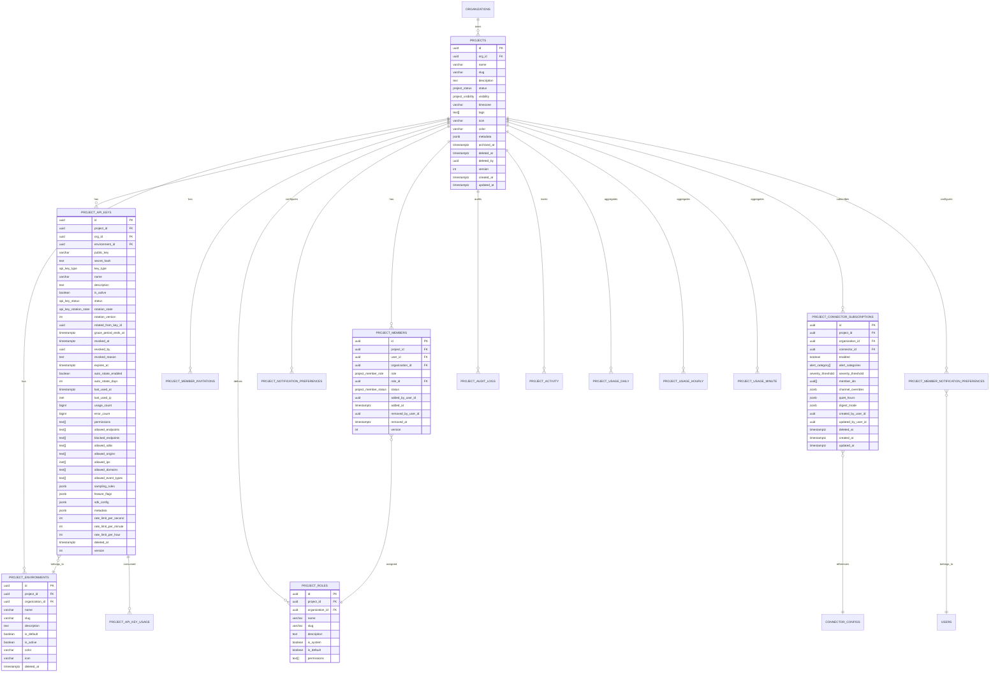
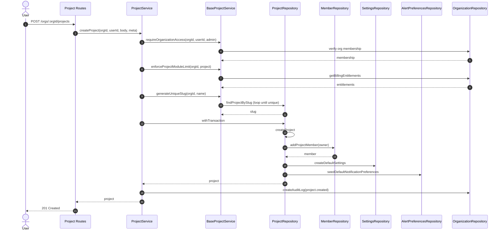
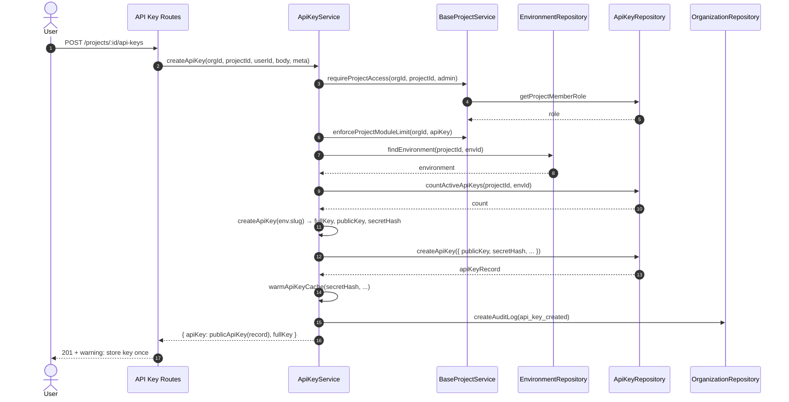
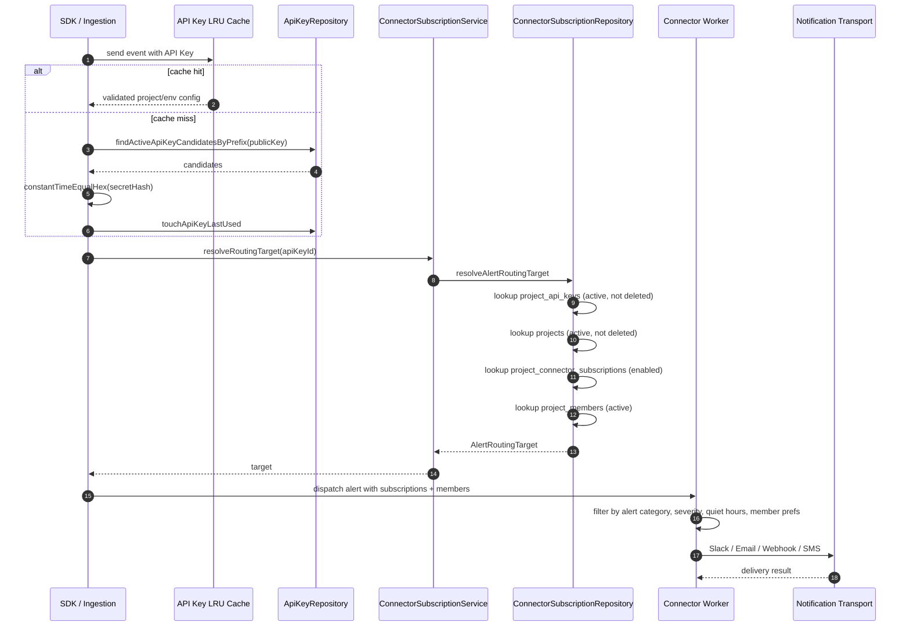
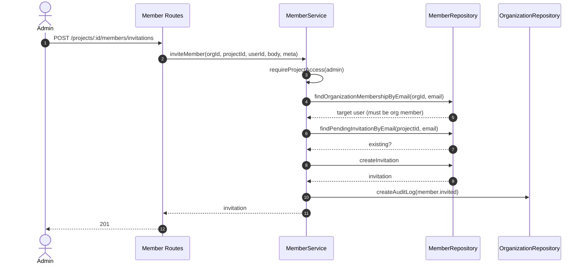
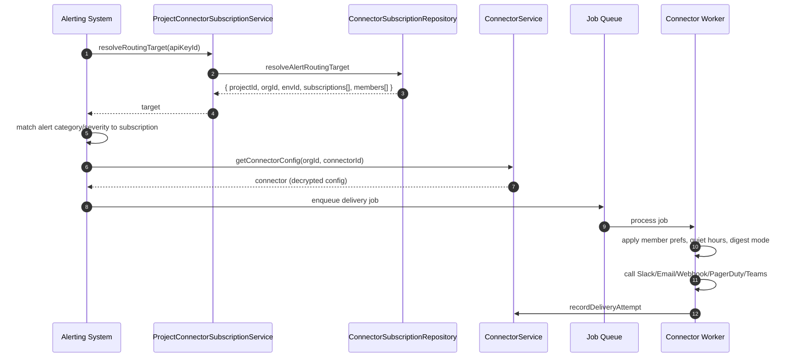

# Project Module — Enterprise Refactor

> Scope: multi-tenant API observability platform (Sentry/Datadog/New Relic class).
> Status: production-ready implementation covering Phases 2–18 of the enterprise refactor.

---

## 1. Architecture overview

The Project Module is the tenant-scoped container for a logical application. It is deliberately lightweight: it only stores identity, visibility, status, and tags. All operational configuration (environments, API keys, SDK config, connectors, alerting, usage analytics) lives in dedicated bounded contexts that reference the project by foreign key.

```
┌─────────────────────────────────────────────────────────────────────────────┐
│                              Organization                                    │
│  (billing, org members, connectors, audit trail)                            │
└─────────────────────────────────────────────────────────────────────────────┘
                                       │
                                       │ owns
                                       ▼
                              ┌─────────────────┐
                              │     Project     │  ← lightweight identity
                              └─────────────────┘
                                       │
          ┌────────────────────────────┼────────────────────────────┐
          │                            │                            │
          ▼                            ▼                            ▼
┌─────────────────┐      ┌─────────────────┐            ┌─────────────────┐
│  Environments   │      │    API Keys     │            │    Members      │
│ (owned by keys) │      │ (hash + prefix) │            │(roles, invites) │
└─────────────────┘      └─────────────────┘            └─────────────────┘
          │                            │                            │
          │                            │                            │
          ▼                            ▼                            ▼
┌─────────────────┐      ┌─────────────────┐            ┌─────────────────┐
│   SDK Config    │      │ Alert Routing   │            │ Usage Analytics │
│                 │      │ (subscriptions) │            │ (time-series)   │
└─────────────────┘      └─────────────────┘            └─────────────────┘
```

---

## 2. Domain boundaries

| Domain | Responsibility | Owns? |
|---|---|---|
| **Project** | Lightweight application identity. | `projects` table. |
| **Environment** | Runtime scope (production, staging, QA, …). | `project_environments`. Created lazily when an API key is minted. |
| **API Key** | Ingestion credential, scoping, rate limits, sampling. | `project_api_keys`. Stores only `public_key` + `secret_hash`. |
| **Members** | Project-level RBAC, invitations, ownership transfer. | `project_members`, `project_member_invitations`, `project_roles`. |
| **Connector Subscriptions** | References org-owned connectors from the project. | `project_connector_subscriptions`. |
| **Alert Preferences** | Project defaults + per-member overrides. | `project_notification_preferences`, `project_member_notification_preferences`. |
| **Usage Analytics** | Time-series aggregations for dashboards. | `project_usage_*` tables (minute/hourly/daily). |
| **Audit / Activity** | Immutable lifecycle records. | `project_audit_logs`, `project_activity`. |

---

## 3. Database schema

### 3.1 Entity relationship diagram



### 3.2 Key indexes

- `idx_projects_org_slug_active` — unique partial index enforcing slug uniqueness for non-deleted projects.
- `idx_api_keys_public_key` — fast key verification lookup.
- `idx_api_keys_active_env` — list/filter active keys by environment.
- `idx_project_members_active` — membership checks.
- `idx_project_connector_subs_enabled` — partial index for alert routing target resolution (excludes soft-deleted rows).
- `idx_project_audit_logs_project_time` — audit log pagination.
- `idx_project_activity_project_time` — activity feed pagination.
- `idx_project_usage_daily_project_time` — dashboard time-series reads.

---

## 4. Sequence diagrams

### 4.1 Project creation



At creation time the transaction inserts:
- one `projects` row (the lightweight identity),
- one `project_members` row for the owner,
- one `project_settings` row with default operational limits,
- one `project_notification_preferences` row for each alert category.

### 4.2 API key creation



### 4.3 Alert routing (API Key → Project → Members)



### 4.4 Member invitation



### 4.5 Connector dispatch



---

## 5. RBAC matrix

System roles are seeded per organization. Custom roles can be created per project.

| Permission | Owner | Admin | Developer | QA | Viewer | Custom |
|---|---|---|---|---|---|---|
| `project:view` | ✅ | ✅ | ✅ | ✅ | ✅ | configurable |
| `project:edit` | ✅ | ✅ | ❌ | ❌ | ❌ | configurable |
| `project:delete` | ✅ | ❌ | ❌ | ❌ | ❌ | configurable |
| `project:transfer_ownership` | ✅ | ❌ | ❌ | ❌ | ❌ | configurable |
| `api_key:view` | ✅ | ✅ | ✅ | ❌ | ✅ | configurable |
| `api_key:create` | ✅ | ✅ | ✅ | ❌ | ❌ | configurable |
| `api_key:rotate` | ✅ | ✅ | ✅ | ❌ | ❌ | configurable |
| `api_key:delete` | ✅ | ✅ | ❌ | ❌ | ❌ | configurable |
| `alert:view` | ✅ | ✅ | ✅ | ✅ | ✅ | configurable |
| `alert:manage` | ✅ | ✅ | ❌ | ✅ | ❌ | configurable |
| `connector:manage` | ✅ | ✅ | ❌ | ❌ | ❌ | configurable |
| `member:manage` | ✅ | ✅ | ❌ | ❌ | ❌ | configurable |
| `role:manage` | ✅ | ✅ | ❌ | ❌ | ❌ | configurable |
| `audit_log:view` | ✅ | ✅ | ❌ | ❌ | ❌ | configurable |
| `release:manage` | ✅ | ✅ | ✅ | ✅ | ❌ | configurable |
| `sdk_config:manage` | ✅ | ✅ | ✅ | ❌ | ❌ | configurable |
| `environment:manage` | ✅ | ✅ | ✅ | ✅ | ❌ | configurable |
| `integration:manage` | ✅ | ✅ | ❌ | ❌ | ❌ | configurable |
| `settings:manage` | ✅ | ✅ | ✅ | ❌ | ❌ | configurable |
| `usage:view` | ✅ | ✅ | ✅ | ✅ | ✅ | configurable |

Authorization checks are centralized in `BaseProjectService.requireProjectAccess`. The service layer never trusts the route layer for role enforcement.

---

## 6. Notification routing flow

1. **SDK event arrives** carrying an API key.
2. **API Key resolution** validates the key, resolves the project and environment, and rejects cross-project or expired/revoked keys.
3. **Project lookup** ensures the project is active and not soft-deleted.
4. **Connector subscriptions** are loaded only for that project. Subscriptions are project-scoped; an org member without a project membership cannot be routed here.
5. **Project members** are loaded only for that project.
6. **Category / severity filtering** drops subscriptions whose `alert_categories` or `severity_threshold` do not match.
7. **Member preference overlay** applies per-member overrides for channels, digest mode, quiet hours, and severity.
8. **Delivery** is attempted only to the resulting set of members and channels.

> **Non-negotiable**: alerts must never be routed using organization membership alone. The API key is the source of truth for project and environment scoping.

---

## 7. API reference (summary)

Base path: `/organizations/:orgId/projects`

| Method | Path | Auth | Description |
|---|---|---|---|
| GET | `/` | member | List projects (search, filter, paginate). |
| POST | `/` | admin | Create lightweight project. |
| GET | `/:projectId` | viewer | Get project. |
| PATCH | `/:projectId` | admin | Update project (optimistic locking via `version`). |
| DELETE | `/:projectId` | owner | Soft delete project; revokes all API keys. |
| POST | `/:projectId/archive` | admin | Archive project. |
| POST | `/:projectId/unarchive` | admin | Restore archived project. |
| POST | `/:projectId/pause` | admin | Pause project. |
| POST | `/:projectId/resume` | admin | Resume project. |
| POST | `/:projectId/restore` | owner | Restore soft-deleted project. |
| GET | `/:projectId/stats` | member | Project stats. |
| GET | `/:projectId/usage` | member | Usage counters. |
| GET | `/:projectId/overview` | viewer | Dashboard overview. |
| GET | `/:projectId/api-keys` | member | List API keys. |
| POST | `/:projectId/api-keys` | admin | Create API key (returns `fullKey` once). |
| GET | `/:projectId/api-keys/:apiKeyId` | member | Get API key (no secret). |
| PATCH | `/:projectId/api-keys/:apiKeyId` | admin | Update API key (optimistic locking). |
| DELETE | `/:projectId/api-keys/:apiKeyId` | owner | Revoke API key. |
| POST | `/:projectId/api-keys/:apiKeyId/rotate` | admin | Rotate API key (grace period). |
| POST | `/:projectId/api-keys/:apiKeyId/regenerate` | admin | Emergency rotate (no grace). |
| POST | `/:projectId/api-keys/:apiKeyId/enable` | admin | Enable key. |
| POST | `/:projectId/api-keys/:apiKeyId/disable` | admin | Disable key. |
| POST | `/:projectId/api-keys/bulk-rotate` | admin | Bulk rotate. |
| POST | `/:projectId/api-keys/bulk-revoke` | owner | Bulk revoke. |
| GET | `/:projectId/environments` | viewer | List environments. |
| POST | `/:projectId/environments` | admin | Create environment. |
| GET | `/:projectId/environments/:envId` | viewer | Get environment. |
| PATCH | `/:projectId/environments/:envId` | admin | Update environment. |
| DELETE | `/:projectId/environments/:envId` | admin | Soft delete environment. |
| GET | `/:projectId/members` | viewer | List members. |
| POST | `/:projectId/members` | admin | Add member. |
| POST | `/:projectId/members/invitations` | admin | Invite member. |
| POST | `/:projectId/members/invitations/:id/accept` | invitee | Accept invitation. |
| POST | `/:projectId/members/invitations/:id/decline` | invitee | Decline invitation. |
| POST | `/:projectId/members/:memberId/role` | admin | Update member role. |
| DELETE | `/:projectId/members/:memberId` | admin | Remove member. |
| POST | `/:projectId/transfer-ownership` | owner | Transfer ownership. |
| GET | `/:projectId/connectors` | viewer | List connector subscriptions. |
| POST | `/:projectId/connectors` | admin | Subscribe to org connector. |
| PATCH | `/:projectId/connectors/:subId` | admin | Update subscription. |
| DELETE | `/:projectId/connectors/:subId` | admin | Unsubscribe. |
| GET | `/:projectId/activity` | viewer | Activity feed. |
| GET | `/:projectId/audit-logs` | admin | Audit logs. |
| GET | `/:projectId/analytics` | viewer | Usage analytics dashboard. |
| GET | `/:projectId/analytics/heatmap` | viewer | Calendar/hourly heatmaps. |
| GET | `/:projectId/analytics/top` | viewer | Top endpoints/errors/releases. |
| GET | `/:projectId/settings` | admin | Get settings. |
| PATCH | `/:projectId/settings` | admin | Update settings. |

### Response envelope

```json
{
  "success": true,
  "data": { ... },
  "meta": { "total": 100, "limit": 20, "offset": 0 }
}
```

### Error envelope

```json
{
  "success": false,
  "error": {
    "code": "PROJECT_CONCURRENT_UPDATE",
    "message": "Project was modified by another request. Please refresh and try again."
  }
}
```

---

## 8. Security model

| Control | Implementation |
|---|---|
| **Tenant isolation** | Every repository query is scoped by `org_id` and/or `project_id`. Authorization is enforced in the service layer before any data access. |
| **Soft delete** | Projects, environments, API keys, and members use soft delete (`deleted_at` / `status = 'removed'`). Hard delete is reserved for connectors subscriptions (with audit log) and must be migrated to soft delete if audit retention is required. |
| **Optimistic locking** | `projects` and `project_api_keys` have a `version` column. `PATCH` requests include `version`; concurrent updates return `409 PROJECT_CONCURRENT_UPDATE` or `409 API_KEY_CONCURRENT_UPDATE`. |
| **API key secrets** | Only `public_key` + `secret_hash` (SHA-256) are persisted. The raw `fullKey` is returned exactly once during `create` and `rotate`. `get/update/enable/disable` never return `secretHash`. |
| **Constant-time verification** | `constantTimeEqualHex` prevents timing attacks during key verification. |
| **Input validation** | Zod schemas at the route boundary; reserved slug validation at the application layer; unique partial indexes at the database layer. |
| **SQL injection prevention** | All queries use parameterized placeholders. The previous `bulkSubscribe` string-interpolation bug was refactored to parameterized placeholders. |
| **Rate limiting** | Route-level rate limiting on project and analytics endpoints. Per-key rate limits are enforced during ingestion. |
| **Idempotency** | Mutating project routes accept an `Idempotency-Key` header; duplicate requests replay the cached response. |
| **Audit logging** | Every create/update/delete/rotate/enable/disable/transfer action is written to `organization_audit_logs` with actor, IP, user agent, request ID, and changed fields. |
| **Secret storage** | Connector secrets are encrypted by the Connector module; API key hashes are SHA-256; no raw secrets are logged. |

---

## 9. Scalability considerations

| Scale target | Strategy |
|---|---|
| 100K organizations | `projects` table partitioned by `org_id` sharding or by range; partial indexes keep hot lookups fast. |
| Millions of projects | Cursor-based pagination; `idx_projects_org_active` avoids scanning deleted rows. |
| Millions of API keys | In-process LRU cache for key verification (30-min TTL); indexes on `public_key` + `deleted_at IS NULL`; verification touches `last_used_at` asynchronously. |
| Millions of members | `project_members` partial index on `status = 'active'`; alert routing loads only active members for a single project. |
| Billions of events | Ingestion writes raw events; analytics reads from pre-aggregated time-series tables (`project_usage_minute`, `project_usage_hourly`, `project_usage_daily`). Dashboards never query raw events. |
| Analytics queries | Downsampling based on time range; cursor pagination; materialized aggregates; cached responses for large ranges. |

### Performance rules

- No N+1 queries: services batch where possible (e.g., project list with key counts in one JOIN).
- Minimal joins for hot paths: API key verification narrows by `public_key` first.
- Connection pooling via `pg.Pool`.
- Async `last_used_at` touch so verification does not block on writes.

---

## 10. Operational runbooks

### 10.1 Adding a new project role

1. Insert a new `project_roles` row with `is_system = FALSE`.
2. Grant the role permissions from the permission registry.
3. Backfill existing `project_members` if a default assignment is required.

### 10.2 Rotating all API keys after a security incident

1. `POST /projects/:projectId/api-keys/bulk-revoke` with `revokedReason`.
2. Re-create keys and redistribute `fullKey` values securely.
3. Review `project_audit_logs` for suspicious key usage.

### 10.3 Restoring a soft-deleted project

1. `POST /projects/:projectId/restore` (owner only).
2. Verify billing subscription is mutable.
3. Re-create API keys; old keys remain revoked.

### 10.4 Alert leakage investigation

1. Confirm `api_key_id` on the alert event.
2. Verify `project_api_keys.project_id` matches the intended project.
3. Check `project_connector_subscriptions` only contains subscriptions for that project.
4. Confirm `project_members.user_id` is scoped to the project.

### 10.5 Analytics backfill

1. Run the background aggregation job from `project_usage_minute` → `hourly` → `daily`.
2. Verify no dashboard reads raw event tables.
3. Invalidate relevant caches.

---

## 11. Migration notes

The refactor is delivered in migration `003_project_module_refactor.sql` plus related code changes.

### Breaking changes

1. `projects.default_environment` removed. Environments are now first-class `project_environments` rows.
2. `connector_configs.project_id` removed. Connectors are organization resources; projects subscribe via `project_connector_subscriptions`.
3. `project_api_keys.environment` text column removed; replaced by `environment_id` foreign key.
4. `project_api_keys` now stores `public_key` + `secret_hash`; legacy keys may need rotation.
5. New `version` columns on `projects` and `project_api_keys` for optimistic locking.

### Backfill steps

1. Seed `project_environments` from existing `project_api_keys.environment` values.
2. Backfill `project_api_keys.environment_id` from the new environments table.
3. Mark revoked keys as `deleted_at = revoked_at`.
4. Seed system project roles for every organization.
5. Seed `project_settings` and `project_notification_preferences` defaults for every project (also provisioned at runtime for new projects).
6. Migrate legacy `connector_configs.project_id` into `project_connector_subscriptions`.

### Rollback considerations

- Soft-deleted projects can be restored via `POST /projects/:projectId/restore`.
- Revoked API keys cannot be re-enabled; rotate instead.
- Connector subscriptions are soft-deleted; `deleted_at` and `updated_by_user_id` are recorded.

---

## 12. Future extensibility

- Add `project_connector_subscriptions.deleted_at` for full soft-delete parity.
- Move project audit logs to a separate time-series store for long-term retention.
- Add read replicas for analytics queries.
- Implement event-sourced projections for project membership changes.
- Add support for SAML/SCIM-provisioned project memberships.

---

*Document version: 1.0 — generated during the enterprise Project Module refactor.*
